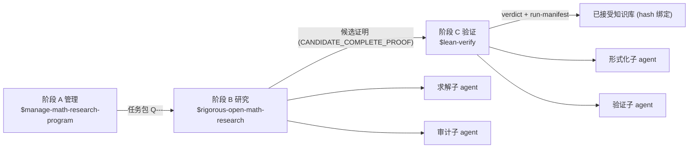

# rigorous-open-math-research

English: [README_EN.md](README_EN.md)

Codex 数学研究工作流插件仓库 (marketplace): 一个仓库装下 管理 → 研究 → 验证 的完整数学研究工作流.

本仓库是标准 Codex marketplace (名 `math-research`), 包含 4 个插件, 安装后可在 Codex 中调用对应 skill.
`math-research-workflow` 是编排层 (旗舰), 把其余三个 skill 组织成三阶段流水线.

## 工作流总览



- 阶段边界强制交接契约 (`assets/pipeline-handoff.template.md`) 与自动 git 同步 (先父仓库, 后 fork).
- 只有 `已证` / `CANDIDATE_COMPLETE_PROOF` 的结果进入阶段 C; `数值证据` / `猜想` / `开放` 显式标注且不进入形式化.

## 插件清单

| 插件 | 提供的 Skill | 定位与能力 |
| --- | --- | --- |
| `math-research-workflow` | 一体化工作流编排 | 编排层 (旗舰): 管理-研究-验证三阶段流水线, 子 agent 分工, 交接契约, 阶段边界 git 同步 |
| `rigorous-open-math-research` | 严格开放数学研究 | 求解执行层: 定理契约, 多路线搜索, 研究台账, 对抗性审计, 文献核验 (引用必须附链接且不得编造), 子 agent 分工 |
| `manage-math-research-program` | 数学研究项目管理 | 项目管理层: 工作区初始化, 文献策展, 开放问题组合, 工具库, 任务包派发, 已接受知识流水线 |
| `lean-verify` | Lean 4 形式化验证 | 验证层: 陈述保真审计, 机器验证 (lake build + sorry/axiom 扫描), 义务级独立审计, hash 绑定运行清单 |

依赖方向 (单向, 无反向调用):

```text
manage-math-research-program -> rigorous-open-math-research
math-research-workflow -> manage-math-research-program + rigorous-open-math-research + lean-verify
lean-verify 独立插件, 与其余 skill 互补
```

## 安装 (推荐: marketplace)

```bash
# 添加本仓库为 marketplace (仅需一次), marketplace 名为 math-research
codex plugin marketplace add xsoc1/rigorous-open-math-research

# 查看可用插件
codex plugin list

# 按需安装 (可只装需要的组件)
codex plugin add math-research-workflow@math-research
codex plugin add rigorous-open-math-research@math-research
codex plugin add manage-math-research-program@math-research
codex plugin add lean-verify@math-research
```

- marketplace 清单位于仓库根 `.agents/plugins/marketplace.json`.
- 安装后需新开一个 Codex 会话以加载插件 skill.

## 安装 (备选: skill-installer)

在 Codex 中使用 `$skill-installer`, 仓库路径分别为

- `xsoc1/rigorous-open-math-research/tree/main/plugins/rigorous-open-math-research/skills/rigorous-open-math-research`
- `xsoc1/rigorous-open-math-research/tree/main/plugins/manage-math-research-program/skills/manage-math-research-program`
- `xsoc1/rigorous-open-math-research/tree/main/plugins/lean-verify/skills/lean-verify`
- `xsoc1/rigorous-open-math-research/tree/main/plugins/math-research-workflow/skills/math-research-workflow`

或手动将对应 skill 目录复制到 `~/.codex/skills/` (Windows: `C:\Users\<用户名>\.codex\skills\`).
`manage-math-research-program` 自带 `MANIFEST.sha256` (sha256 逐文件校验清单), 修改后需重新生成.

## 仓库结构

```text
.
├── .agents/plugins/marketplace.json      # marketplace 清单 (插件顺序 = Codex 渲染顺序)
├── .github/workflows/validate.yml        # CI: 仓库级校验
├── plugins/
│   ├── math-research-workflow/           # 编排插件 (旗舰): 三阶段流水线编排
│   │   ├── .codex-plugin/plugin.json
│   │   ├── agents/openai.yaml
│   │   ├── assets/pipeline-handoff.template.md
│   │   └── skills/math-research-workflow/ (SKILL.md + references/workflow-design.md)
│   ├── rigorous-open-math-research/      # 求解执行层
│   ├── manage-math-research-program/     # 项目管理层
│   └── lean-verify/                      # 验证层
├── scripts/validate_all.py               # 本地校验入口 (与 CI 共用)
├── AGENTS.md                             # 仓库维护约定与会话记录
├── LICENSE
└── README.md
```

每个插件统一形态: `.codex-plugin/plugin.json` + `skills/<name>/SKILL.md` (+ 可选 `agents/`, `assets/`, `scripts/`, `references/`, `examples/`).

## 校验

```bash
# 本地校验: marketplace + 全部插件 + SKILL frontmatter + MANIFEST + UTF-8/BOM
python scripts/validate_all.py

# 行为冒烟: lean-verify 扫描器 + 编排层门禁
python tests/smoke_lean_verify.py
python tests/smoke_pipeline_gate.py
```

push / PR 时 GitHub Actions 自动运行以上校验与冒烟.

## 使用

| 场景 | 调用 |
| --- | --- |
| 数学项目 研究+验证 全流程 (含子 agent 分工) | `$math-research-workflow` |
| 单个数学问题 (证明/反例/构造/审计) | `$rigorous-open-math-research` |
| 长期项目/文献/工具库/任务包/知识库维护 | `$manage-math-research-program` |
| Lean 4 形式化验证 | `$lean-verify` |

- 若项目根目录是 git 仓库, skill 会自动检查并保持仓库同步 (会话开始 `git status`/`git fetch`, 阶段收尾提交并推送), 详见 `manage-math-research-program/references/git-sync.md`.
- 所有研究结论遵循严格性标注: `严格证明` / `数值证据` / `猜想` 显式区分, 未完成严格证明的断言不标为 "已解决".

## 同步

- 父仓库: `xsoc1/rigorous-open-math-research`
- fork 副本: `Zhongshan-Big-Jun/rigorous-open-math-research` (同步方式: push 父仓库后, 在 fork 上执行 GitHub 的 Sync fork / merge-upstream)

## 版本历史
- 2026-08-16: 四插件社区方法蒸馏第二轮 - 检索证据契约与目标问题状态确认 (fetch_required/status 三态/uncertainty-warnings, 来源: modsearch/argo/dsh-zotero/dsh-exa-mcp/dsh-kb-sieve/dsh-web-search-pro), 多 agent 协作增强 (义务认领防重复/缺口回灌/并行失败聚合/循环检测/Lean 升级通道, 来源: dsh-suite team-board/dsh-proof/dsh-agent-team-gui/dsh-trajectory-governance/dsh-rigorquant), Lean 验证增强 (单一结构化判定 gate 协议/原子有界检查/同缺口三轮收敛/证伪优先裁决, 来源: forge-gates/jacobian/dsh-rigorquant/Vibe-Mathematics), 研究方法论增强 (covered_scope+residual_risk/反例-only 对抗/双导线 ground-truth/假说状态机/证据边界/工具溯源/禁用清单, 来源: Aegis/dsh-rigorquant/dsh-science/dsh-scholar/dsh-design-skills/dsh-ops-kit; 四插件 cachebuster `0.1.0+codex.20260815171704`).
- 2026-08-16: manage 新增人类可读证明交付规范 (工作流 8c) - Lean 验证通过 (FORMALLY_VERIFIED + build_passed + 零 sorry/axiom) 的定理必须在 `papers/<SLUG>/` 交付 LaTeX 证明文档: 英文 arXiv 规范版 (amsart + amsthm/amsmath/hyperref, 摘要/编号定理环境/DOI 或 arXiv 链接参考文献, xelatex 零警告) + 中文对照版, 文档头绑定机器验证契约; 证据规则 13 + 项目完成清单 + 模板 `assets/proof-paper.template.tex` + init/validate 门禁 (cachebuster `0.1.0+codex.20260815170001`).
- 2026-08-16: 新增“进展全登记 + 每个新结果形式化 scaffold”规则 - 问题进展/失败路线/新工具必须登记; 每个新结果 (含 RIGOROUS_PARTIAL_RESULT) 在存在 `lean-proof/` 时必须创建 Lean scaffold 并更新形式化进度; run-manifest 形式化决策新增 `scaffold`, `validate_pipeline.py` 对 2026-08-16 后新 run 强制 scaffold/requested; lean-verify 新增 Scaffold mode 与 `SCAFFOLDED` 状态 (四插件 cachebuster `0.1.0+codex.20260816180000`).
- 2026-08-16: 交接手续改良 - 交接记录独立成文并必须包含 `Completed work progress` (已完成进度, 后续不得重做) 与 `Tools and methods tried` (尝试过的工具/方法/命令 + 结果标记 + 证据路径 + sha256); 门禁新增两个必需 section (workflow/manage cachebuster `0.1.0+codex.20260816183000`).
- 2026-08-16: Lean 验证定位微调 - 中间承重引理尽早机器验证 (避免走弯路), 更先进结果可把旧 scaffold/partial 标记 `superseded` 并保留历史; 四插件 cachebuster `0.1.0+codex.20260816190000`.
- 2026-08-16: 新增证明文件提交审计流程 (manage 8e) - 提交证明文件必须依次经过 仓库比对 -> Lean 验证与审计 -> 依规则加入; 新增模板 `assets/proof-submission-audit.template.md`, 四插件 cachebuster `0.1.0+codex.20260816193000`.
- 2026-08-16: 插件效率优化 - 新增 `scripts/scaffold_result.py` (自动生成 scaffold/STATUS/progress/audit) 与 `scripts/index_lean_lemmas.py` (生成 `LEMMA_INDEX.md` 复用索引); 引入 Tier 0/1/2 分级验证; 证明前先查复用索引避免重复证明 (四插件 cachebuster `0.1.0+codex.20260816200000`).
- 2026-08-16: Rethlas 方法蒸馏 - 新增 `references/rethlas-distilled.md`: 持久结构化记忆、失败综合驱动下一代方案、分解计划组合筛选与递归并行、反例复用库、搜索是支撑不是替代、外部引用非黑盒、严格零错误零缺口接受、论文式蓝图输出 (rigorous/manage/workflow cachebuster `0.1.0+codex.20260816210000`).
- 2026-08-16: 双轨审计蒸馏 - 新增 `references/dual-track-audit.md`: Danus 式非正式审计与 Lean 形式化验证共存 (非正式审计 -> Lean scaffold -> Lean 完整验证 -> 论文级再验证), 冲突裁决规则, Danus 硬禁止项, 验证矩阵 (四插件 cachebuster `0.1.0+codex.20260816220000`).
- 2026-08-16: OpenProver token-conscious 吸收 - 新增 `references/openprover-absorption.md` (workflow): Planner action 协议、Repository item 系统、`theorem.lean` 前置骨架、Planner history、token budget pause+handoff+resume (预算耗尽不丢工作); manage 新增 `assets/budget-state.template.json` (rigorous/manage/workflow cachebuster `0.1.0+codex.20260816230000`).
- 2026-08-16: 研究地图 - 每个项目维护人类可读、持续更新的 `research_map.md` (路线/方法、中间结果与意外发现、失败原因、工具库、开放方向、avoid list、人类/其他 agent 补充); 新增 `assets/research-map.template.md` + `scripts/update_research_map.py` (manage 8f), Stage A/B/C 边界强制更新, 防钻牛角尖, 部分进展也入图 (rigorous/manage/workflow cachebuster `0.1.0+codex.20260816240000`).
- 2026-08-14: workflow 蒸馏 OpenProver 方法 (arXiv:2607.09217) - Planner-Worker-Verifier 求解循环: 每 run 强制紧凑 whiteboard (计划/路线历史/待回想法/未完成义务/工件索引), 独立并行 Worker 与独立 Verifier 反馈, Lean 实时验证回路 (lean_verify/lean_search/lean_store), 形式化反馈环, 人工引导; 门禁硬校验 2026-08-14 后求解 run 的 whiteboard (cachebuster `0.1.0+codex.20260814120000`).
- 2026-08-13: workflow 新增中断交接协议 - 工作中断时写 `handoff-interrupted-<ts>.md` (已尝试路线带 `[FAILED|BLOCKED|PARTIAL|SUCCEEDED]` 标记、未完成义务、精确下一步、关键文件哈希), 后续 agent 依记录续接, 禁止无新理由重跑失败路线; `validate_pipeline.py` 硬校验交接记录字段, 新增 smoke_handoff 测试入 CI (cachebuster `0.1.0+codex.20260813144928`).
- 2026-08-13: workflow 新增 Stage B0 强制前置门禁 - open 判定 + 发散式新颖性审计 + 文献快照哈希回填 (任务包必须携带 `## Novelty preflight (B0)`, `validate_pipeline.py` 机械拦截); manage 任务包模板同步 (cachebuster `0.1.0+codex.20260813101438`); 修复 CI: MANIFEST 哈希换行规范化 (CRLF/LF 双基准) 与 doctor 冒烟的环境依赖.
- 2026-08-13: workflow 插件增强 - 环境自检 `doctor.py` + 门禁数值证据纪律与状态一致性审计 (cachebuster `0.1.0+codex.20260813054312`).
- 2026-08-13: 新增确定性阶段门禁 `validate_pipeline.py` + lean-verify/门禁 CI 冒烟 (workflow cachebuster `0.1.0+codex.20260812164950`).
- 2026-08-12: AI4Math V2 方法蒸馏 (发散检索/验证者 FAIL/失败路由/陈述冻结/四道闸/首错定位等).
- 2026-08-12: 编排为工作流插件仓库 (marketplace 排序/CI/LICENSE/AGENTS, 校验器严格 YAML/JSON).
- 2026-08-11: 编排为标准 marketplace (名 math-research), 新增 workflow 与 lean-verify 插件.
- 2026-08-10: MRP 新增自动 git 仓库同步检查 (工作流第 0 步 + Rigor Phase 0/10/12).
- 2026-08-09: 蒸馏 Blueprint v2.2 数学工具包.
- 2026-08-05: rigorous 迭代自 rigorous-mathematical-research, 建立 manage 插件.

## 版权与免责声明

- 版权归属: 本仓库的编排结构, 提示词组织, 文档与脚本由作者整合撰写, 按 MIT 许可分发 (见 `LICENSE`); 但其中的工作方法大量参考/改编自公开研究与开源项目 (如 MMAT, LeanMarathon, MechMath, M2F, FaithSieve, FormalRx, Archon-Horizon, EvE 等), 方法本身的思想与协议不归本仓库所有.
- 方法来源: 各 SKILL.md 的 Changelog 已附来源链接 (MMAT, LeanMarathon, MechMath, M2F, FaithSieve, FormalRx, Archon-Horizon, EvE, Blueprint v2.x 等), 引用以链接与要点转述形式呈现, 未复制受版权保护的论文正文或专有代码; 若署名或归属有误, 欢迎指正, 我们会在确认后修正.
- 第三方名称: 文中出现的项目, 组织与商标名称归各自所有者, 与本仓库无隶属或背书关系.
- 使用风险: 本仓库按"现状"提供, 不保证无缺陷; 生成的研究结果, 证明, 代码与结论须由使用者独立核验后再使用, 作者不对任何直接或间接损失负责, 内容不构成专业或法律意见.
