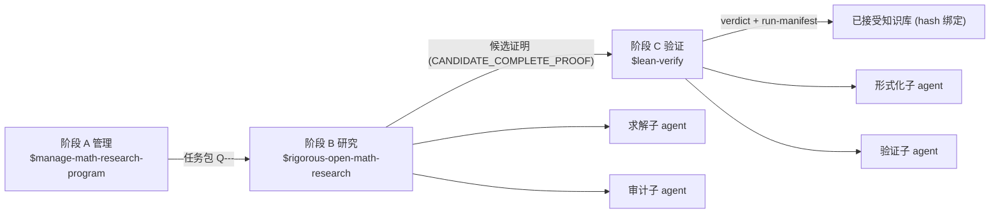

# rigorous-open-math-research

Codex 数学研究工作流插件仓库 (marketplace): 一个仓库装下 管理 → 研究 → 验证 的完整数学研究工作流.

本仓库是标准 Codex marketplace (名 `math-research`), 包含 4 个插件, 安装后可在 Codex 中调用对应 skill.
`math-research-workflow` 是编排层 (旗舰), 把其余三个 skill 组织成三阶段流水线.

## 工作流总览



- 阶段边界强制交接契约 (`assets/pipeline-handoff.template.md`) 与自动 git 同步 (先父仓库, 后 fork).
- 只有 `已证` / `CANDIDATE_COMPLETE_PROOF` 的结果进入阶段 C; `数值证据` / `猜想` / `开放` 显式标注且不进入形式化.

## 插件清单

| 插件 | 提供的 Skill | 定位与能力 |
| --- | --- | --- |
| `math-research-workflow` | 一体化工作流编排 | 编排层 (旗舰): 管理-研究-验证三阶段流水线, 子 agent 分工, 交接契约, 阶段边界 git 同步 |
| `rigorous-open-math-research` | 严格开放数学研究 | 求解执行层: 定理契约, 多路线搜索, 研究台账, 对抗性审计, 文献核验 (引用必须附链接且不得编造), 子 agent 分工 |
| `manage-math-research-program` | 数学研究项目管理 | 项目管理层: 工作区初始化, 文献策展, 开放问题组合, 工具库, 任务包派发, 已接受知识流水线 |
| `lean-verify` | Lean 4 形式化验证 | 验证层: 陈述保真审计, 机器验证 (lake build + sorry/axiom 扫描), 义务级独立审计, hash 绑定运行清单 |

依赖方向 (单向, 无反向调用):

```text
manage-math-research-program -> rigorous-open-math-research
math-research-workflow -> manage-math-research-program + rigorous-open-math-research + lean-verify
lean-verify 独立插件, 与其余 skill 互补
```

## 安装 (推荐: marketplace)

```bash
# 添加本仓库为 marketplace (仅需一次), marketplace 名为 math-research
codex plugin marketplace add xsoc1/rigorous-open-math-research

# 查看可用插件
codex plugin list

# 按需安装 (可只装需要的组件)
codex plugin add math-research-workflow@math-research
codex plugin add rigorous-open-math-research@math-research
codex plugin add manage-math-research-program@math-research
codex plugin add lean-verify@math-research
```

- marketplace 清单位于仓库根 `.agents/plugins/marketplace.json`.
- 安装后需新开一个 Codex 会话以加载插件 skill.

## 安装 (备选: skill-installer)

在 Codex 中使用 `$skill-installer`, 仓库路径分别为

- `xsoc1/rigorous-open-math-research/tree/main/plugins/rigorous-open-math-research/skills/rigorous-open-math-research`
- `xsoc1/rigorous-open-math-research/tree/main/plugins/manage-math-research-program/skills/manage-math-research-program`
- `xsoc1/rigorous-open-math-research/tree/main/plugins/lean-verify/skills/lean-verify`
- `xsoc1/rigorous-open-math-research/tree/main/plugins/math-research-workflow/skills/math-research-workflow`

或手动将对应 skill 目录复制到 `~/.codex/skills/` (Windows: `C:\Users\<用户名>\.codex\skills\`).
`manage-math-research-program` 自带 `MANIFEST.sha256` (sha256 逐文件校验清单), 修改后需重新生成.

## 仓库结构

```text
.
├── .agents/plugins/marketplace.json      # marketplace 清单 (插件顺序 = Codex 渲染顺序)
├── .github/workflows/validate.yml        # CI: 仓库级校验
├── plugins/
│   ├── math-research-workflow/           # 编排插件 (旗舰): 三阶段流水线编排
│   │   ├── .codex-plugin/plugin.json
│   │   ├── agents/openai.yaml
│   │   ├── assets/pipeline-handoff.template.md
│   │   └── skills/math-research-workflow/ (SKILL.md + references/workflow-design.md)
│   ├── rigorous-open-math-research/      # 求解执行层
│   ├── manage-math-research-program/     # 项目管理层
│   └── lean-verify/                      # 验证层
├── scripts/validate_all.py               # 本地校验入口 (与 CI 共用)
├── AGENTS.md                             # 仓库维护约定与会话记录
├── LICENSE
└── README.md
```

每个插件统一形态: `.codex-plugin/plugin.json` + `skills/<name>/SKILL.md` (+ 可选 `agents/`, `assets/`, `scripts/`, `references/`, `examples/`).

## 校验

```bash
# 本地校验: marketplace + 全部插件 + SKILL frontmatter + MANIFEST + UTF-8/BOM
python scripts/validate_all.py
```

push / PR 时 GitHub Actions 自动运行 `scripts/validate_all.py`.

## 使用

| 场景 | 调用 |
| --- | --- |
| 数学项目 研究+验证 全流程 (含子 agent 分工) | `$math-research-workflow` |
| 单个数学问题 (证明/反例/构造/审计) | `$rigorous-open-math-research` |
| 长期项目/文献/工具库/任务包/知识库维护 | `$manage-math-research-program` |
| Lean 4 形式化验证 | `$lean-verify` |

- 若项目根目录是 git 仓库, skill 会自动检查并保持仓库同步 (会话开始 `git status`/`git fetch`, 阶段收尾提交并推送), 详见 `manage-math-research-program/references/git-sync.md`.
- 所有研究结论遵循严格性标注: `严格证明` / `数值证据` / `猜想` 显式区分, 未完成严格证明的断言不标为 "已解决".

## 同步

- 父仓库: `xsoc1/rigorous-open-math-research`
- fork 副本: `Zhongshan-Big-Jun/rigorous-open-math-research` (同步方式: push 父仓库后, 在 fork 上执行 GitHub 的 Sync fork / merge-upstream)

## 版本历史

 - 2026-08-12: 编排为工作流插件仓库: 统一 4 插件元数据 (字段顺序 / developerName / 描述修复), workflow 插件补齐 agents 配置, marketplace 顺序调整为编排插件置顶, 插件版本 cachebuster 更新为 `0.1.0+codex.20260811160208`, 新增 LICENSE / validate_all.py / CI / 根 AGENTS.md, README 重写 (流水线图 + 结构树 + 校验与同步说明).
- 2026-08-11: 仓库编排为标准 Codex marketplace (`.agents/plugins/marketplace.json`, 名 `math-research`); 4 个插件统一元数据 (author/repository/license/版本 cachebuster `0.1.0+codex.20260811`); README 安装方式改为 marketplace 优先.
- 2026-08-11: 新增 `math-research-workflow` 一体化编排插件 (管理-研究-验证三阶段流水线 + 子 agent 分工 + 交接契约 + 阶段边界 git 同步).
- 2026-08-11: 新增 `lean-verify` 插件 (Lean 4 形式化验证: 陈述保真审计, 机器验证, 义务级独立审计, 结构化裁决与 hash 绑定运行清单).
- 2026-08-11: 子 agent 分工模式 (rigorous-open-math-research): 路线探索/义务证明/反例猎手/文献审计/证明验证并行分工, 子任务包契约 (裸 JSON + artifact_sha256, 合并前重算哈希核验); 新增 arXiv 定理语义检索与结构化验证输出规范.
- 2026-08-10: 新增自动 git 仓库同步检查 (MRP 工作流第 0 步 + Rigor Phase 0/10/12).
- 2026-08-09: 蒸馏 Blueprint v2.2 数学工具包 (数学超图/类型/状态语义/可信闭包/四审计/事务-研究状态分离), 整合进两个 skill.
- 2026-08-05: `rigorous-open-math-research` 迭代自 `rigorous-mathematical-research`; 建立 `manage-math-research-program`.
