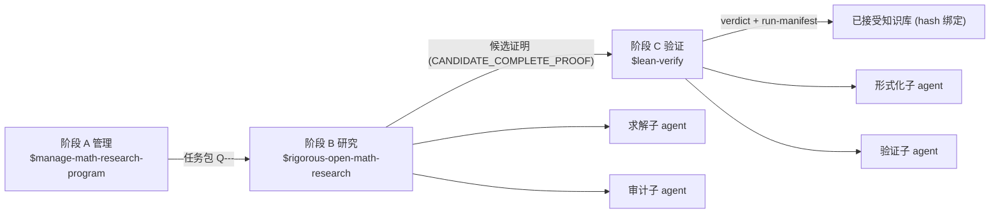

# rigorous-open-math-research

English: [README_EN.md](README_EN.md)

Codex 数学研究工作流插件仓库 (marketplace): 一个仓库装下 管理 → 研究 → 验证 的完整数学研究工作流.

本仓库是标准 Codex marketplace (名 `math-research`), 包含 4 个插件, 安装后可在 Codex 中调用对应 skill.
`math-research-workflow` 是编排层 (旗舰), 把其余三个 skill 组织成三阶段流水线.

## 工作流总览



- 阶段边界强制交接契约 (`assets/pipeline-handoff.template.md`) 与自动 git 同步 (先父仓库, 后 fork).
- 只有 `已证` / `CANDIDATE_COMPLETE_PROOF` 的结果进入阶段 C; `数值证据` / `猜想` / `开放` 显式标注且不进入形式化.
- 一轮完整运行的所有分支与终态见 [`docs/pipeline-full-flow.md`](docs/pipeline-full-flow.md).

## 插件清单

| 插件 | 提供的 Skill | 定位与能力 |
| --- | --- | --- |
| `math-research-workflow` | 一体化工作流编排 | 编排层 (旗舰): 管理-研究-验证三阶段流水线, 子 agent 分工, 交接契约, 阶段边界 git 同步 |
| `rigorous-open-math-research` | 严格开放数学研究 | 求解执行层: 定理契约, 多路线搜索, 研究台账, 对抗性审计, 文献核验 (引用必须附链接且不得编造), 子 agent 分工 |
| `manage-math-research-program` | 数学研究项目管理 | 项目管理层: 工作区初始化, 文献策展, 开放问题组合, 工具库, 任务包派发, 已接受知识流水线 |
| `lean-verify` | Lean 4 形式化验证 | 验证层: 陈述保真审计, 机器验证 (lake build + sorry/axiom 扫描), 义务级独立审计, hash 绑定运行清单 |

依赖方向 (单向, 无反向调用):

```text
manage-math-research-program -> rigorous-open-math-research
math-research-workflow -> manage-math-research-program + rigorous-open-math-research + lean-verify
lean-verify 独立插件, 与其余 skill 互补
```

## 安装 (推荐: marketplace)

```bash
# 添加本仓库为 marketplace (仅需一次), marketplace 名为 math-research
codex plugin marketplace add xsoc1/rigorous-open-math-research

# 查看可用插件
codex plugin list

# 按需安装 (可只装需要的组件)
codex plugin add math-research-workflow@math-research
codex plugin add rigorous-open-math-research@math-research
codex plugin add manage-math-research-program@math-research
codex plugin add lean-verify@math-research
```

- marketplace 清单位于仓库根 `.agents/plugins/marketplace.json`.
- 安装后需新开一个 Codex 会话以加载插件 skill.

## 安装 (备选: skill-installer)

在 Codex 中使用 `$skill-installer`, 仓库路径分别为

- `xsoc1/rigorous-open-math-research/tree/main/plugins/rigorous-open-math-research/skills/rigorous-open-math-research`
- `xsoc1/rigorous-open-math-research/tree/main/plugins/manage-math-research-program/skills/manage-math-research-program`
- `xsoc1/rigorous-open-math-research/tree/main/plugins/lean-verify/skills/lean-verify`
- `xsoc1/rigorous-open-math-research/tree/main/plugins/math-research-workflow/skills/math-research-workflow`

或手动将对应 skill 目录复制到 `~/.codex/skills/` (Windows: `C:\Users\<用户名>\.codex\skills\`).
`manage-math-research-program` 自带 `MANIFEST.sha256` (sha256 逐文件校验清单), 修改后需重新生成.

## 仓库结构

```text
.
├── .agents/plugins/marketplace.json      # marketplace 清单 (插件顺序 = Codex 渲染顺序)
├── .github/workflows/validate.yml        # CI: 仓库级校验
├── plugins/
│   ├── math-research-workflow/           # 编排插件 (旗舰): 三阶段流水线编排
│   │   ├── .codex-plugin/plugin.json
│   │   ├── agents/openai.yaml
│   │   ├── assets/                     # handoff/whiteboard/interruption-state 模板
│   │   ├── scripts/checkpoint_resume.py # 配额 checkpoint/resume 确定性工具
│   │   └── skills/math-research-workflow/ (SKILL.md + references/workflow-design.md)
│   ├── rigorous-open-math-research/      # 求解执行层
│   ├── manage-math-research-program/     # 项目管理层
│   └── lean-verify/                      # 验证层
├── scripts/validate_all.py               # 本地校验入口 (与 CI 共用)
├── AGENTS.md                             # 仓库维护约定与会话记录
├── LICENSE
└── README.md
```

每个插件统一形态: `.codex-plugin/plugin.json` + `skills/<name>/SKILL.md` (+ 可选 `agents/`, `assets/`, `scripts/`, `references/`, `examples/`).

## 校验

```bash
# 本地校验: marketplace + 插件结构 + SKILL frontmatter/上下文预算 + Markdown fence + MANIFEST + UTF-8/BOM
python scripts/validate_all.py

# 行为冒烟: lean-verify 扫描器 + 编排层门禁
python tests/smoke_lean_verify.py
python tests/smoke_pipeline_gate.py
python tests/smoke_scoped_pipeline.py
python tests/smoke_checkpoint_resume.py
```

push / PR 时 GitHub Actions 自动运行以上校验与冒烟.

## 使用

| 场景 | 调用 |
| --- | --- |
| 数学项目 研究+验证 全流程 (含子 agent 分工) | `$math-research-workflow` |
| 单个数学问题 (证明/反例/构造/审计) | `$rigorous-open-math-research` |
| 长期项目/文献/工具库/任务包/知识库维护 | `$manage-math-research-program` |
| Lean 4 形式化验证 | `$lean-verify` |

- 若项目根目录是 git 仓库, skill 会自动检查并保持仓库同步 (会话开始 `git status`/`git fetch`, 阶段收尾提交并推送), 详见 `manage-math-research-program/references/git-sync.md`.
- 所有研究结论遵循严格性标注: `严格证明` / `数值证据` / `猜想` 显式区分, 未完成严格证明的断言不标为 "已解决".

## 同步

- 父仓库: `xsoc1/rigorous-open-math-research`
- fork 副本: `Zhongshan-Big-Jun/rigorous-open-math-research` (同步方式: push 父仓库后, 在 fork 上执行 GitHub 的 Sync fork / merge-upstream)

## 版本历史

| 版本 | 日期 | 摘要 |
| --- | --- | --- |
| `1.11.0` | 2026-08-30 | workflow 隔离作用域门禁: `--scope` 把仓库内自包含目录作为完整逻辑项目根, 所有发现和路径绑定均限制在 scope 内; scope 外历史债务不参与局部裁决, 输出明确禁止把 scoped PASS 当作全仓 PASS |
| `1.10.0` | 2026-08-30 | rigorous/workflow checkpoint 可用性优化: `advance` 自动版本化 bound whiteboard/closure 并生成防误封 draft; 修复 project-prefixed path 与 PowerShell 7 位时间戳; typed obligation lineage 自动退休旧 action |
| `1.9.0` | 2026-08-29 | rigorous/workflow 配额中断恢复: 结构化保存 completed/open/in-flight/do-not-repeat 状态, 用不可变 checkpoint 在恢复前复算全部 hash; 唯一 predecessor receipt 锁定跨 segment 谱系, 最小读取集/首个动作/计分累计量/状态变更均受确定性门禁保护 |
| `1.8.0` | 2026-08-28 | rigorous/workflow fast-close 证书: 结构化冻结 contract/obligation graph/proof/root anchors/dependencies, 用 hash-bound 独立审计触发确定性 STOP; 禁止追加 Stage B 路线与重复全局审计, 单次 frontier 升级必须绑定原证书, 授权, 正整数预算和停止条件 |
| `1.7.0` | 2026-08-27 | rigorous/workflow closure-first 性能优化: 先直接求解并证伪首个承重义务, 再按明确决策增量扩展子 agent; 延迟生成非必要工件, 全局审计移至完成或交接边界 |
| `1.6.0` | 2026-08-24 | Codex 性能优化: 四个 SKILL 入口移出 changelog, 修复 rigorous 输出协议 fence, 增加上下文预算与 Markdown 门禁, 加入索引检索和有界工具批处理规则 |
| `1.5.0` | 2026-08-23 | 性能可观测与示警: performance.json + baseline 对比, 成本异常上升时写 performance_alert 并向用户示警, 单次告警需复验 |
| `1.4.0` | 2026-08-23 | 工具按问题类作用域生命周期: 类级退休/归档, 工具不删除仍可显式检索, manage_tool_lifecycle.py |
| `1.3.0` | 2026-08-23 | 轻量 reuse 协议 (紧凑预扫描 + 最低产物集 + reuse_summary + 强制 Lean scaffold) |
| `1.2.0` | 2026-08-16 | 轻量优先成本分级升级协议 (Tier 0-3, 小改动优先, 升级触发/回退, 白板与任务包集成) |
| `1.1.0` | 2026-08-16 | 研究地图 / 双轨审计 / OpenProver·Rethlas·Danus 蒸馏 / lake build 防护与鲁棒性 / 性能优化 |
| `1.0.0` | 2026-08-16 | 初始稳定版: 四插件工作流 + 提交审计 + 进展登记/scaffold + 交接协议 |

版本规则: 大版本 = 工作流架构/能力代际; 小版本 = 新功能批次; 补丁 = 纯修复。
历史 cachebuster (0.1.0+codex.日期) 已并入上表, 不再使用日期后缀。

## 版权与免责声明

- 版权归属: 本仓库的编排结构, 提示词组织, 文档与脚本由作者整合撰写, 按 MIT 许可分发 (见 `LICENSE`); 但其中的工作方法大量参考/改编自公开研究与开源项目 (如 MMAT, LeanMarathon, MechMath, M2F, FaithSieve, FormalRx, Archon-Horizon, EvE 等), 方法本身的思想与协议不归本仓库所有.
- 方法来源: 各 skill 的 `references/changelog.md` 已附来源链接 (MMAT, LeanMarathon, MechMath, M2F, FaithSieve, FormalRx, Archon-Horizon, EvE, Blueprint v2.x 等), 引用以链接与要点转述形式呈现, 未复制受版权保护的论文正文或专有代码; 若署名或归属有误, 欢迎指正, 我们会在确认后修正.
- 第三方名称: 文中出现的项目, 组织与商标名称归各自所有者, 与本仓库无隶属或背书关系.
- 使用风险: 本仓库按"现状"提供, 不保证无缺陷; 生成的研究结果, 证明, 代码与结论须由使用者独立核验后再使用, 作者不对任何直接或间接损失负责, 内容不构成专业或法律意见.
