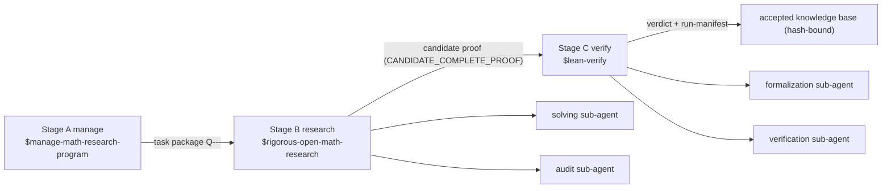

# rigorous-open-math-research

中文版: [README.md](README.md)

Codex mathematics research workflow plugin repository (marketplace): a complete manage → research → verify mathematics research workflow in one repository.

This repository is a standard Codex marketplace (named `math-research`) containing 4 plugins; after installation, the corresponding skills can be invoked in Codex. `math-research-workflow` is the orchestration layer (flagship) that organizes the other three skills into a three-stage pipeline.

## Workflow overview



- Stage boundaries enforce handoff contracts (`assets/pipeline-handoff.template.md`) and automatic git sync (parent repository first, then fork).
- Only `已证` / `CANDIDATE_COMPLETE_PROOF` results enter Stage C; `数值证据` / `猜想` / `开放` are explicitly labeled and never enter formalization.

## Plugin list

| Plugin | Provided Skill | Role and capabilities |
| --- | --- | --- |
| `math-research-workflow` | Integrated workflow orchestration | Orchestration layer (flagship): manage-research-verify three-stage pipeline, sub-agent division of labor, handoff contracts, stage-boundary git sync |
| `rigorous-open-math-research` | Rigorous open mathematics research | Solving/execution layer: theorem contracts, multi-route search, research ledger, adversarial audit, literature verification (citations must include links and must not be fabricated), sub-agent division of labor |
| `manage-math-research-program` | Mathematics research program management | Project management layer: workspace initialization, literature curation, open-problem portfolios, tool library, task-package dispatch, accepted-knowledge pipeline |
| `lean-verify` | Lean 4 formal verification | Verification layer: statement-fidelity audit, machine verification (lake build + sorry/axiom scan), obligation-level independent audit, hash-bound run manifests |

Dependency direction (one-way, no reverse calls):

```text
manage-math-research-program -> rigorous-open-math-research
math-research-workflow -> manage-math-research-program + rigorous-open-math-research + lean-verify
lean-verify is a standalone plugin, complementary to the other skills
```

## Installation (recommended: marketplace)

```bash
# Add this repository as a marketplace (once), marketplace name: math-research
codex plugin marketplace add xsoc1/rigorous-open-math-research

# List available plugins
codex plugin list

# Install as needed (only the components you need)
codex plugin add math-research-workflow@math-research
codex plugin add rigorous-open-math-research@math-research
codex plugin add manage-math-research-program@math-research
codex plugin add lean-verify@math-research
```

- The marketplace manifest lives at `.agents/plugins/marketplace.json` in the repo root.
- After installation, start a new Codex session to load the plugin skills.

## Installation (alternative: skill-installer)

In Codex, use `$skill-installer` with the repository paths

- `xsoc1/rigorous-open-math-research/tree/main/plugins/rigorous-open-math-research/skills/rigorous-open-math-research`
- `xsoc1/rigorous-open-math-research/tree/main/plugins/manage-math-research-program/skills/manage-math-research-program`
- `xsoc1/rigorous-open-math-research/tree/main/plugins/lean-verify/skills/lean-verify`
- `xsoc1/rigorous-open-math-research/tree/main/plugins/math-research-workflow/skills/math-research-workflow`

or manually copy the corresponding skill directories to `~/.codex/skills/` (Windows: `C:\Users\<username>\.codex\skills\`).
`manage-math-research-program` ships with a `MANIFEST.sha256` (per-file sha256 verification manifest); regenerate it after modifications.

## Repository structure

```text
.
├── .agents/plugins/marketplace.json      # marketplace manifest (plugin order = Codex render order)
├── .github/workflows/validate.yml        # CI: repository-level validation
├── plugins/
│   ├── math-research-workflow/           # orchestration plugin (flagship): three-stage pipeline orchestration
│   │   ├── .codex-plugin/plugin.json
│   │   ├── agents/openai.yaml
│   │   ├── assets/pipeline-handoff.template.md
│   │   └── skills/math-research-workflow/ (SKILL.md + references/workflow-design.md)
│   ├── rigorous-open-math-research/      # solving/execution layer
│   ├── manage-math-research-program/     # project management layer
│   └── lean-verify/                      # verification layer
├── scripts/validate_all.py               # local validation entry (shared with CI)
├── AGENTS.md                             # repository maintenance conventions and session log
├── LICENSE
└── README.md
```

Each plugin has a uniform shape: `.codex-plugin/plugin.json` + `skills/<name>/SKILL.md` (+ optional `agents/`, `assets/`, `scripts/`, `references/`, `examples/`).

## Validation

```bash
# Local validation: marketplace + all plugins + SKILL frontmatter + MANIFEST + UTF-8/BOM
python scripts/validate_all.py

# Behavior smoke: lean-verify scanner + pipeline gate
python tests/smoke_lean_verify.py
python tests/smoke_pipeline_gate.py
```

GitHub Actions automatically runs the validation and smoke tests on push / PR.

## Usage

| Scenario | Invoke |
| --- | --- |
| Full research+verification workflow for a mathematics project (incl. sub-agent division of labor) | `$math-research-workflow` |
| A single mathematics problem (proof / counterexample / construction / audit) | `$rigorous-open-math-research` |
| Long-term project / literature / tool library / task packages / knowledge base maintenance | `$manage-math-research-program` |
| Lean 4 formal verification | `$lean-verify` |

- If the project root is a git repository, the skill automatically checks and keeps the repository in sync (session start `git status` / `git fetch`; commit and push at stage boundaries); see `manage-math-research-program/references/git-sync.md`.
- All research conclusions follow a strictness labeling convention: `严格证明` (rigorous proof) / `数值证据` (numerical evidence) / `猜想` (conjecture) explicitly distinguished; assertions without a rigorous proof are never labeled "solved".

## Sync

- Parent repository: `xsoc1/rigorous-open-math-research`
- Fork copy: `Zhongshan-Big-Jun/rigorous-open-math-research` (sync method: after pushing to the parent, run GitHub's Sync fork / merge-upstream on the fork)

## Version history
- 2026-08-16: Second round of community method distillation across all four plugins - retrieval evidence contract and target-problem status confirmation (fetch_required / status tri-state / uncertainty-vs-warnings, from modsearch, argo, dsh-zotero, dsh-exa-mcp, dsh-kb-sieve, dsh-web-search-pro); multi-agent collaboration (obligation claim-ownership, gap re-injection, parallel failure aggregation, loop detection, Lean escalation lane, from dsh-suite plugin-team-board, dsh-proof, dsh-agent-team-gui, dsh-trajectory-governance, dsh-rigorquant); Lean verification (single structured judgment gate protocol, atomic bounded checks, same-gap three-round convergence, falsification-first verdict, from forge-gates, jacobian, dsh-rigorquant, Vibe-Mathematics); research methodology (covered_scope + residual_risk, counterexample-only adversary, dual-wire ground truth, hypothesis state machine, evidence boundary, tool provenance, forbidden moves, from Aegis, dsh-rigorquant, dsh-science, dsh-scholar, dsh-design-skills, dsh-ops-kit; all four cachebusters `0.1.0+codex.20260815171704`).
- 2026-08-16: manage added a mandatory human-readable proof delivery (workflow 8c) - every theorem whose Lean verification passes (FORMALLY_VERIFIED + build_passed + zero sorry/axiom) must ship a LaTeX proof under `papers/<SLUG>/`: an English arXiv-style version (amsart + amsthm/amsmath/hyperref, abstract, numbered theorem environments, references with DOI or arXiv links, xelatex zero warnings) plus a Chinese companion, with the machine-verification contract stated in the header; evidence rule 13 + completion checklist + template `assets/proof-paper.template.tex` + init/validate gates (cachebuster `0.1.0+codex.20260815170001`).
- 2026-08-14: Workflow distilled the OpenProver method (arXiv:2607.09217) - a Planner-Worker-Verifier solve loop with a mandatory compact whiteboard per run (plan / route history / deferred ideas / open obligations / artifact index), independent parallel Workers and independent Verifier feedback, a Lean real-time verification loop (lean_verify / lean_search / lean_store), a formalization feedback loop, and interactive steering; the gate hard-requires the whiteboard for solver runs started on or after 2026-08-14 (cachebuster `0.1.0+codex.20260814120000`).
- 2026-08-13: Workflow gained an interruption handoff protocol - on any interruption the stopping agent writes `handoff-interrupted-<ts>.md` (attempted routes with `[FAILED|BLOCKED|PARTIAL|SUCCEEDED]` outcome markers, open obligations, exact next actions, hashed key artifacts) so a successor agent resumes without blind re-exploration; `validate_pipeline.py` hard-checks handoff fields, new smoke_handoff test wired into CI (cachebuster `0.1.0+codex.20260813144928`).
- 2026-08-13: Workflow gained a mandatory Stage B0 preflight - openness check + divergent novelty audit + literature snapshot-hash backfill (task packets must carry `## Novelty preflight (B0)`, enforced mechanically by `validate_pipeline.py`); manage task-packet template updated (cachebuster `0.1.0+codex.20260813101438`); CI fixes: MANIFEST hashing normalized across CRLF/LF worktrees and doctor smoke no longer depends on a local config.toml.
- 2026-08-13: Hardened the workflow plugin - environment preflight `doctor.py` + numerical-evidence discipline and claim-consistency audit in the stage gate (cachebuster `0.1.0+codex.20260813054312`).
- 2026-08-13: Added the deterministic stage gate `validate_pipeline.py` + lean-verify/gate CI smoke tests (workflow cachebuster `0.1.0+codex.20260812164950`).
- 2026-08-12: AI4Math V2 method distillation (divergent search / verifier FAIL / failure routing / statement freeze / four gates / first-error localization).
- 2026-08-12: Restructured as a workflow plugin repository (marketplace ordering / CI / LICENSE / AGENTS, strict YAML/JSON validation).
- 2026-08-11: Standard marketplace (named math-research); added workflow and lean-verify plugins.
- 2026-08-10: MRP gained automatic git repository sync checks (workflow step 0 + Rigor Phase 0/10/12).
- 2026-08-09: Distilled Blueprint v2.2 mathematics toolkit.
- 2026-08-05: rigorous iterated from rigorous-mathematical-research; added manage plugin.

## Copyright and disclaimer

- Copyright: the orchestration structure, prompt organization, documents and scripts in this repository were compiled and written by the author and are distributed under the MIT license (see `LICENSE`); however, the working methods substantially reference/adapt public research and open-source projects (e.g., MMAT, LeanMarathon, MechMath, M2F, FaithSieve, FormalRx, Archon-Horizon, EvE, etc.), and the ideas and protocols of the methods themselves do not belong to this repository.
- Method sources: each SKILL.md's Changelog includes source links (MMAT, LeanMarathon, MechMath, M2F, FaithSieve, FormalRx, Archon-Horizon, EvE, Blueprint v2.x, etc.); citations are presented as links and point-form paraphrases, and no copyright-protected paper text or proprietary code is copied; if attribution is incorrect, corrections are welcome and will be fixed after confirmation.
- Third-party names: project, organization and trademark names appearing in this repository belong to their respective owners and have no affiliation or endorsement relationship with this repository.
- Use at your own risk: this repository is provided "as is" without warranty of any kind; generated research results, proofs, code and conclusions must be independently verified by users before use; the author is not liable for any direct or indirect loss, and the content does not constitute professional or legal advice.
