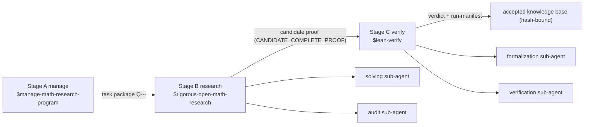

# rigorous-open-math-research

中文版: [README.md](README.md)

Codex mathematics research workflow plugin repository (marketplace): a complete manage → research → verify mathematics research workflow in one repository.

This repository is a standard Codex marketplace (named `math-research`) containing 4 plugins; after installation, the corresponding skills can be invoked in Codex. `math-research-workflow` is the orchestration layer (flagship) that organizes the other three skills into a three-stage pipeline.

## Workflow overview



- Stage boundaries enforce handoff contracts (`assets/pipeline-handoff.template.md`) and automatic git sync (parent repository first, then fork).
- Only `已证` / `CANDIDATE_COMPLETE_PROOF` results enter Stage C; `数值证据` / `猜想` / `开放` are explicitly labeled and never enter formalization.
- All branches and terminal states of a full run: [`docs/pipeline-full-flow.md`](docs/pipeline-full-flow.md).

## Plugin list

| Plugin | Provided Skill | Role and capabilities |
| --- | --- | --- |
| `math-research-workflow` | Integrated workflow orchestration | Orchestration layer (flagship): manage-research-verify three-stage pipeline, sub-agent division of labor, handoff contracts, stage-boundary git sync |
| `rigorous-open-math-research` | Rigorous open mathematics research | Solving/execution layer: theorem contracts, multi-route search, research ledger, adversarial audit, literature verification (citations must include links and must not be fabricated), sub-agent division of labor |
| `manage-math-research-program` | Mathematics research program management | Project management layer: workspace initialization, literature curation, open-problem portfolios, tool library, task-package dispatch, accepted-knowledge pipeline |
| `lean-verify` | Lean 4 formal verification | Verification layer: statement-fidelity audit, machine verification (lake build + sorry/axiom scan), obligation-level independent audit, hash-bound run manifests |

Dependency direction (one-way, no reverse calls):

```text
manage-math-research-program -> rigorous-open-math-research
math-research-workflow -> manage-math-research-program + rigorous-open-math-research + lean-verify
lean-verify is a standalone plugin, complementary to the other skills
```

## Installation (recommended: marketplace)

```bash
# Add this repository as a marketplace (once), marketplace name: math-research
codex plugin marketplace add xsoc1/rigorous-open-math-research

# List available plugins
codex plugin list

# Install as needed (only the components you need)
codex plugin add math-research-workflow@math-research
codex plugin add rigorous-open-math-research@math-research
codex plugin add manage-math-research-program@math-research
codex plugin add lean-verify@math-research
```

- The marketplace manifest lives at `.agents/plugins/marketplace.json` in the repo root.
- After installation, start a new Codex session to load the plugin skills.

## Installation (alternative: skill-installer)

In Codex, use `$skill-installer` with the repository paths

- `xsoc1/rigorous-open-math-research/tree/main/plugins/rigorous-open-math-research/skills/rigorous-open-math-research`
- `xsoc1/rigorous-open-math-research/tree/main/plugins/manage-math-research-program/skills/manage-math-research-program`
- `xsoc1/rigorous-open-math-research/tree/main/plugins/lean-verify/skills/lean-verify`
- `xsoc1/rigorous-open-math-research/tree/main/plugins/math-research-workflow/skills/math-research-workflow`

or manually copy the corresponding skill directories to `~/.codex/skills/` (Windows: `C:\Users\<username>\.codex\skills\`).
`manage-math-research-program` ships with a `MANIFEST.sha256` (per-file sha256 verification manifest); regenerate it after modifications.

## Repository structure

```text
.
├── .agents/plugins/marketplace.json      # marketplace manifest (plugin order = Codex render order)
├── .github/workflows/validate.yml        # CI: repository-level validation
├── plugins/
│   ├── math-research-workflow/           # orchestration plugin (flagship): three-stage pipeline orchestration
│   │   ├── .codex-plugin/plugin.json
│   │   ├── agents/openai.yaml
│   │   ├── assets/                     # handoff/whiteboard/interruption-state templates
│   │   ├── scripts/checkpoint_resume.py # deterministic quota checkpoint/resume tool
│   │   └── skills/math-research-workflow/ (SKILL.md + references/workflow-design.md)
│   ├── rigorous-open-math-research/      # solving/execution layer
│   ├── manage-math-research-program/     # project management layer
│   └── lean-verify/                      # verification layer
├── scripts/validate_all.py               # local validation entry (shared with CI)
├── AGENTS.md                             # repository maintenance conventions and session log
├── LICENSE
└── README.md
```

Each plugin has a uniform shape: `.codex-plugin/plugin.json` + `skills/<name>/SKILL.md` (+ optional `agents/`, `assets/`, `scripts/`, `references/`, `examples/`).

## Validation

```bash
# Local validation: marketplace + plugin structure + SKILL frontmatter/context budgets + Markdown fences + MANIFEST + UTF-8/BOM
python scripts/validate_all.py

# Behavior smoke: lean-verify scanner + pipeline gate
python tests/smoke_lean_verify.py
python tests/smoke_pipeline_gate.py
python tests/smoke_scoped_pipeline.py
python tests/smoke_formalization_handoff.py
python tests/smoke_checkpoint_resume.py
```

GitHub Actions automatically runs the validation and smoke tests on push / PR.

## Usage

| Scenario | Invoke |
| --- | --- |
| Full research+verification workflow for a mathematics project (incl. sub-agent division of labor) | `$math-research-workflow` |
| A single mathematics problem (proof / counterexample / construction / audit) | `$rigorous-open-math-research` |
| Long-term project / literature / tool library / task packages / knowledge base maintenance | `$manage-math-research-program` |
| Lean 4 formal verification | `$lean-verify` |

- If the project root is a git repository, the skill automatically checks and keeps the repository in sync (session start `git status` / `git fetch`; commit and push at stage boundaries); see `manage-math-research-program/references/git-sync.md`.
- All research conclusions follow a strictness labeling convention: `严格证明` (rigorous proof) / `数值证据` (numerical evidence) / `猜想` (conjecture) explicitly distinguished; assertions without a rigorous proof are never labeled "solved".

## Sync

- Parent repository: `xsoc1/rigorous-open-math-research`
- Fork copy: `Zhongshan-Big-Jun/rigorous-open-math-research` (sync method: after pushing to the parent, run GitHub's Sync fork / merge-upstream on the fork)

## Version history

| Version | Date | Summary |
| --- | --- | --- |
| `1.13.0` | 2026-08-30 | Workflow canonical formalization consumption: `consume/verify-consumption` writes one immutable sibling record after an exact-copy receipt is `READY`, explicitly preserves mathematical and verification status, permits legitimate later Stage C destination-scaffold evolution, and uses exclusive creation to close overwrite TOCTOU |
| `1.12.0` | 2026-08-30 | Workflow cross-root formalization handoff: an immutable exact-copy Tier 0 scaffold receipt binds the Stage B scope and Stage C Lean project identities, source manifest/proof/scaffold, destination copy, and durable registration anchors; full requested packages remain unsupported and no FORMALLY_VERIFIED promotion occurs |
| `1.11.0` | 2026-08-30 | Workflow scoped gate: `--scope` treats a self-contained nested directory as a complete logical project and confines discovery plus bindings to it; legacy debt outside the scope is excluded, and the result explicitly cannot be reported as a whole-project PASS |
| `1.10.0` | 2026-08-30 | Rigorous/workflow checkpoint usability: `advance` versions bound whiteboard/closure files and creates a guarded draft; project-prefixed paths and PowerShell seven-digit timestamps work; typed obligation lineage retires predecessor actions automatically |
| `1.9.0` | 2026-08-29 | Rigorous/workflow quota recovery: structure completed/open/in-flight/do-not-repeat state, recheck every hash before resume, bind each segment to one predecessor receipt, and gate the minimal read set, first action, cumulative scored metrics, and reviewed status transitions |
| `1.8.0` | 2026-08-28 | Rigorous/workflow fast-close certificate: structurally freeze the contract, obligation graph, proof, root anchors, and dependencies; a hash-bound independent audit triggers deterministic STOP, while one frontier upgrade must bind the certificate, authorization, positive budget, and stop condition |
| `1.7.0` | 2026-08-27 | Rigorous/workflow closure-first optimization: directly attack and falsify the first load-bearing obligation before sub-agent expansion, require decision deltas, materialize artifacts lazily, and defer global audits to completion or handoff boundaries |
| `1.6.0` | 2026-08-24 | Codex performance optimization: moved changelogs out of all four SKILL entrypoints, repaired the rigorous output-protocol fence, added context-budget and Markdown gates, and introduced indexed discovery plus bounded tool batching |
| `1.5.0` | 2026-08-23 | Performance observability and alerts: metrics/baseline comparison, writes performance_alert and warns user on cost regressions; single-run alerts require confirmation |
| `1.4.0` | 2026-08-23 | Class-scoped tool lifecycle: per-class retirement/archive, tools never deleted, explicit retrieval, manage_tool_lifecycle.py |
| `1.3.0` | 2026-08-23 | Lightweight reuse protocol (compact pre-scan + minimum artifact set + reuse_summary + mandatory Lean scaffold) |
| `1.2.0` | 2026-08-16 | Light-first cost-tiered escalation protocol (Tier 0-3, minimal-change priority, upgrade triggers/fallback, whiteboard and task-packet integration) |
| `1.1.0` | 2026-08-16 | Research map / dual-track audit / OpenProver-Rethlas-Danus distillation / lake build guard + robustness / performance |
| `1.0.0` | 2026-08-16 | Initial stable release: four-plugin workflow + submission audit + progress/scaffold + handoff |

Versioning rule: major = architecture/capability generation; minor = feature batch; patch = pure fixes.
The former date-based cachebusters (0.1.0+codex.date) were consolidated into this table and are no longer used.

## Copyright and disclaimer

- Copyright: the orchestration structure, prompt organization, documents and scripts in this repository were compiled and written by the author and are distributed under the MIT license (see `LICENSE`); however, the working methods substantially reference/adapt public research and open-source projects (e.g., MMAT, LeanMarathon, MechMath, M2F, FaithSieve, FormalRx, Archon-Horizon, EvE, etc.), and the ideas and protocols of the methods themselves do not belong to this repository.
- Method sources: each skill's `references/changelog.md` includes source links (MMAT, LeanMarathon, MechMath, M2F, FaithSieve, FormalRx, Archon-Horizon, EvE, Blueprint v2.x, etc.); citations are presented as links and point-form paraphrases, and no copyright-protected paper text or proprietary code is copied; if attribution is incorrect, corrections are welcome and will be fixed after confirmation.
- Third-party names: project, organization and trademark names appearing in this repository belong to their respective owners and have no affiliation or endorsement relationship with this repository.
- Use at your own risk: this repository is provided "as is" without warranty of any kind; generated research results, proofs, code and conclusions must be independently verified by users before use; the author is not liable for any direct or indirect loss, and the content does not constitute professional or legal advice.
