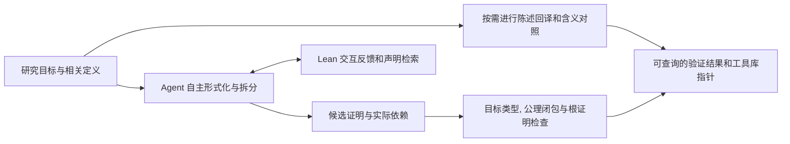

# Lean 验证平台调研: Numina Fuse, Prove2Me 与插件优化

日期: 2026-09-09, Asia/Shanghai. 状态: RESEARCH_AND_DISCUSSION. 本文保留 [2.0 重构方案](v2.0-refactor-plan.md) 原文, 提供 Lean 验证与审计的讨论依据, 尚未改变插件实现或发布版本.

## 1. 调研结论与证据范围

两项报道都有发布机构的一手说明和公开 Lean 证明工件支持. 本次查到的三维挂谷工件包含条件推导, 粘性挂谷定理及两种数学表述之间的连接; 费马大定理工件的根目标覆盖所有自然数指数 `n >= 3`. 因此, 不能把它们概括成只有媒体宣传或只证明有限特例. 同时, 本次做的是来源阅读与代码核查, 没有在本机重编译这两个大型证明. 发布方报告的验证成功仍应与本次独立复现区分. [数学院挂谷公告](https://www.amss.ac.cn/kyjz1/202609/t20260908_8279602.html), [挂谷证明入口](https://github.com/project-numina/kakeya-3d/blob/f305ef6555788849c87caa987f161abc990d8c2c/README.md), [Anthropic FLT 公告](https://www.anthropic.com/research/formalizing-fermats-last-theorem), [FLT 根目标](https://github.com/anthropics/fermats-last-theorem/blob/aa2d8b34692b16c70f699536de0d8e75b9a3e9ef/Theorems/Thm_fermat_last_theorem.lean#L128).

对插件最值得采用的方向是: 让 agent 自由组织形式化, 用工具维持精确目标, 给出快速编译反馈并计算证明依赖是否闭合, 将数学语义审计集中在根命题, 关键定义和连接处. 这是本文根据平台材料与本地代码提出的设计判断, 不是已经测得的 Astra 性能提升.

| 对象 | 公开材料支持的结果 | 本次核实边界 |
| --- | --- | --- |
| Fuse / 三维挂谷 | AMSS 与 Numina 的形式化接入南开/Seed 的粘性挂谷结果, 提供完整根目标的连接代码 | 读取固定提交的根声明, 连接文件, 环境锁与检查配置. 默认构建不包含完整连接层. 未执行大型构建 |
| Prove2Me / FLT | 完整 FLT 根命题, 发布方报告 Lean, comparator 和单独运行的 Nanoda 检查成功 | 读取根目标, Mathlib 对照, 检查脚本和补丁. 发布方元数据仍标记 self-assessed, 不能表述成本次或独立第三方的完整重放 |
| 两个平台的效率 | 展示了大型协作形式化的可行组织方法 | 没有同题, 同模型, 同资源的 Fuse / Prove2Me / 空白对照, 无法推出平台各自贡献的提速比例 |

Fuse 和 Prove2Me 是提供工作环境, 协作或验证服务的平台. Numina-Lean-Agent, Claude 或 Astra 是产生与修改证明的 agent / 模型. Lean kernel 检查形式推导, comparator 核对可信目标及其定义并可安排重放, Nanoda 是另一套 kernel 实现. 平台名称不能代替这几种不同证据. [Fuse 发布说明](https://lean.nyc/assets/files/numina-fuse-announcement.pdf), [Prove2Me 介绍](https://prove2.me/about), [Lean 官方验证说明](https://lean-lang.org/doc/reference/latest/ValidatingProofs/).

## 2. 三维挂谷究竟形式化到了哪里

### 2.1 根目标与完整连接

Numina 仓库公开的目标是实三维欧氏空间中, 每个包含所有方向单位线段的紧集都具有 Hausdorff 维数 3. 本文沿用这一精确公开表述, 不额外扩写成任意集合版本或所有挂谷相关猜想. 仓库分开提供两个入口. [目标与构建范围](https://github.com/project-numina/kakeya-3d/blob/f305ef6555788849c87caa987f161abc990d8c2c/README.md).

```lean
KakeyaDimensionThree :
	StickyKakeya.StickyFrostmanHypothesis -> KakeyaSetConjecture 3

KakeyaDimensionThree_of_pureWZ2 :
	KakeyaSetConjecture 3
```

以上是源码中声明类型的摘录, 不是本次运行输出. 第一条将粘性挂谷的某种 Frostman 表述作为显式输入. 第二条在 `Unconditional/KakeyaConjecture.lean` 调用实际连接引理, 消去这个额外输入. [条件入口检查](https://github.com/project-numina/kakeya-3d/blob/f305ef6555788849c87caa987f161abc990d8c2c/FinalCheck.lean), [完整根定理](https://github.com/project-numina/kakeya-3d/blob/f305ef6555788849c87caa987f161abc990d8c2c/Unconditional/KakeyaConjecture.lean), [连接引理](https://github.com/project-numina/kakeya-3d/blob/f305ef6555788849c87caa987f161abc990d8c2c/Unconditional/StickyFrostman.lean).

这里的连接具有数学内容. GWZ 所用的 Frostman 覆盖层级与 Wang-Zahl 定理的 Convex Wolff 覆盖条件并不是同一 Lean 类型, 不能凭论文说它们对应就直接接上. 公开连接库证明了所需转换, 再调用南开/Seed 形式化的 Wang-Zahl Theorem 5.2. 这正是审计跨论文工具复用时应重点检查的位置. [证明路径](https://github.com/project-numina/kakeya-3d/blob/f305ef6555788849c87caa987f161abc990d8c2c/PROOF-PATH.md), [连接库](https://github.com/project-numina/kakeya-3d/tree/f305ef6555788849c87caa987f161abc990d8c2c/Unconditional), [粘性挂谷项目](https://github.com/M32026/3d-sticky-kakeya/tree/42f739b484fd055e0aa29601c35677ad996f2ef2).

### 2.2 为什么只看 build 和公理扫描会判断错范围

默认 `lake build` 的对象是 `Kakeya` 主体库. 完整连接层另需取得固定版本的粘性挂谷仓库并运行 `verification/unconditional/run.sh`. 它不是默认目标. 本次直接读取的连接锁固定了两个项目与 Mathlib, 检查文件同时核对完整根声明和实际公理闭包. [连接锁](https://github.com/project-numina/kakeya-3d/blob/f305ef6555788849c87caa987f161abc990d8c2c/verification/unconditional/bridge-lock.json), [连接构建程序](https://github.com/project-numina/kakeya-3d/blob/f305ef6555788849c87caa987f161abc990d8c2c/verification/unconditional/run.sh), [连接层检查](https://github.com/project-numina/kakeya-3d/blob/f305ef6555788849c87caa987f161abc990d8c2c/verification/unconditional/AxiomCheck.lean).

关键逻辑区别是: `H -> T` 完全可以不依赖自定义公理, 但它仍然没有证明 `T`. 因此, 即使 `#print axioms` 只显示通常允许的公理, 也必须核对实际证明的类型是不是委托验证的类型. 反过来, 一个原定理本来就有的数学假设应保留在目标中; 所谓闭合, 是没有超出该目标的未证依赖, 并不是删除定理的全部假设.

该项目还提供 comparator 的可信目标与递归常量比较配置. 条件目标的 challenge 仍依赖固定的项目底层定义, 因而其信任边界比仅用 Mathlib 表述一个经典数论命题更大. 本次读到的完整目标配置将 Nanoda 关闭; 不能将 Lean kernel 重放写成第二套独立 kernel 通过. [comparator 方法与边界](https://github.com/project-numina/kakeya-3d/blob/f305ef6555788849c87caa987f161abc990d8c2c/verification/comparator/README.md), [完整目标配置](https://github.com/project-numina/kakeya-3d/blob/f305ef6555788849c87caa987f161abc990d8c2c/verification/comparator/config-unconditional.json).

### 2.3 Fuse 提供什么工作方式

Project Numina 的发布说明描述了一个连接 GitHub Lean 仓库的网页工作环境: 在云端工作区读取与修改项目, 接收 TeX blueprint 和证明提示, 交互处理目标或用 Auto 模式持续推进, 并在适合时组织并行子任务. 人类数学家仍提供关键定义, 证明框架与数学判断. 本次未登录产品或测试真实任务, 也未核实完整 Fuse 后端或公开 API. [Numina 发布说明, Lean NYC 保存的公告镜像](https://lean.nyc/assets/files/numina-fuse-announcement.pdf), [数学院项目说明](https://www.amss.ac.cn/kyjz1/202609/t20260908_8279602.html).

可读的 Numina-Lean-Agent 论文与仓库提供了更具体的工具思路: 读取 Lean goal 和 diagnostics, 搜索已存在声明, 用实际编译错误修正接口, 必要时将失败证明块抽成带完整局部上下文的小引理. 论文所述 LSP 工具与当前公开仓库中的 `lean-check` CLI 也不是同一个版本的完整产品说明. 本次不能认定部署中的 Fuse 与公开 agent 仓库逐文件相同. [Numina-Lean-Agent 论文](https://arxiv.org/html/2601.14027v1), [公开 agent](https://github.com/project-numina/numina-lean-agent/tree/1c9af8a52e715f22fede766425ba3d3b95526132), [结构化检查输出](https://github.com/project-numina/numina-lean-agent/blob/1c9af8a52e715f22fede766425ba3d3b95526132/skills/verification/reference-lean-check.md), [Sorrifier 用法](https://github.com/project-numina/numina-lean-agent/blob/1c9af8a52e715f22fede766425ba3d3b95526132/skills/sorrifier/SKILL.md).

不建议整份复制它的协调提示. 公开 coordinator 文件仍有 CHECKLIST 和固定 30 次尝试等较重规定. 本文建议借鉴可调用工具和接口设计, 是否分工, 尝试多少次及何时换路线由任务决定. 这也避免违背已经保留的 2.0 精简方向. [公开协调提示](https://github.com/project-numina/numina-lean-agent/blob/1c9af8a52e715f22fede766425ba3d3b95526132/prompts/autosearch/subagent_prompts/coordinator.md).

## 3. 费马大定理与 Prove2Me

### 3.1 完整 FLT 与发表范围

Anthropic 于 2026-09-04 发布的材料报告: 数十个 agent 用 11 天完成形式化, 使用约 60 亿 output tokens, 产出约 1300 万 Lean 行, 使用既有数学证明与已有形式化成果. 所用模型是内部研究模型, 公告没有提供可公开复现的完整模型与运行配置. 这些说明了工作规模, 不能拿来预测本项目的耗时或成本. [官方公告](https://www.anthropic.com/research/formalizing-fermats-last-theorem).

公开工件的根命题是: 对所有自然数 `n >= 3` 和正自然数 `a,b,c`, 有 `a^n + b^n != c^n`. `FinalCheck.lean` 进一步将它接到 Mathlib 的 `FermatLastTheorem`, 显式处理正数与非零自然数的等价条件. 本次读取了这些声明及桥接代码. [根目标与实际证明调用](https://github.com/anthropics/fermats-last-theorem/blob/aa2d8b34692b16c70f699536de0d8e75b9a3e9ef/Theorems/Thm_fermat_last_theorem.lean#L128), [Mathlib 对照入口](https://github.com/anthropics/fermats-last-theorem/blob/aa2d8b34692b16c70f699536de0d8e75b9a3e9ef/FinalCheck.lean), [固定 Mathlib 定义](https://github.com/leanprover-community/mathlib4/blob/db584cd6d46c92f209a44c0f1c829460d327499d/Mathlib/NumberTheory/FLT/Basic.lean#L52).

完整 FLT 不代表证明路径上所有著名中间理论的一般形式全部完成. 项目说明将部分中间结论限定在 Frey 曲线, octahedral 表示或特定模提升条件下. 工具库保存这些成果时, 应记录实际可调用的声明范围, 不从名称推导出更强的普遍结论. [PROOF-PATH.md](https://github.com/anthropics/fermats-last-theorem/blob/aa2d8b34692b16c70f699536de0d8e75b9a3e9ef/PROOF-PATH.md).

### 3.2 其验证比一次编译多了什么

| 检查 | 发布工件中的实现或说明 | 保证边界 |
| --- | --- | --- |
| 根声明与实际公理 | `FinalCheck.lean` 检查根结论与公理, 作者报告使用 `propext`, `Classical.choice`, `Quot.sound` | 针对实际形式目标, 不代替目标含义审查 |
| comparator | 用 Mathlib-only challenge 核对声明及相关常量, 检查公理并通过 Lean kernel 重放 | 不等同于第二套 kernel 实现 |
| 单独的 Nanoda 检查 | 脚本固定独立 Rust kernel, 作者报告 1,052,234 个声明检查无误 | 发布方执行的独立实现检查, 不等于独立第三方审计或本次复现 |

来源: [作者验证摘要](https://github.com/anthropics/fermats-last-theorem/blob/aa2d8b34692b16c70f699536de0d8e75b9a3e9ef/README.md), [comparator Challenge](https://github.com/anthropics/fermats-last-theorem/blob/aa2d8b34692b16c70f699536de0d8e75b9a3e9ef/verification/comparator/Challenge.lean), [运行脚本](https://github.com/anthropics/fermats-last-theorem/blob/aa2d8b34692b16c70f699536de0d8e75b9a3e9ef/verification/comparator/run.sh), [Nanoda 运行脚本](https://github.com/anthropics/fermats-last-theorem/blob/aa2d8b34692b16c70f699536de0d8e75b9a3e9ef/verification/nanoda/run.sh).

有三处需要准确记录. 首先, FLT 的 comparator 配置也写着 `enable_nanoda: false`, 但该项目另有 Nanoda 运行目录, 因此不能据单个开关断言它没有第二 kernel 检查. 其次, Nanoda 使用了四个本地补丁, 检查身份应包含补丁; 本次没有证明补丁保持健全性. 再次, 两项目的研究用 comparator 包装均可使用无实际沙箱的 fake-landrun, 不应直接宣传成隔离验证任意不可信代码的服务. [FLT 配置](https://github.com/anthropics/fermats-last-theorem/blob/aa2d8b34692b16c70f699536de0d8e75b9a3e9ef/verification/comparator/config.json), [Nanoda 补丁](https://github.com/anthropics/fermats-last-theorem/tree/aa2d8b34692b16c70f699536de0d8e75b9a3e9ef/verification/nanoda/patches), [挂谷 comparator 说明](https://github.com/project-numina/kakeya-3d/blob/f305ef6555788849c87caa987f161abc990d8c2c/verification/comparator/README.md).

FLT 的 `formalization.yaml` 写明 `review.status: self-assessed` 和空 reviewers. 本次固定提交的 verification 树未发现完整原始成功日志; 本文引用的是作者摘要和可复查程序. 本次不把这些限制解释为证明错误, 也不升级证据等级. [元数据](https://github.com/anthropics/fermats-last-theorem/blob/aa2d8b34692b16c70f699536de0d8e75b9a3e9ef/formalization.yaml), [验证文件](https://github.com/anthropics/fermats-last-theorem/tree/aa2d8b34692b16c70f699536de0d8e75b9a3e9ef/verification).

### 3.3 Prove2Me 的关键组织方法

Prove2Me 将稳定的定理声明与具体证明分开管理. 定理可以暂时只有带类型的占位声明, 多个 agent 分别提交证明对象. 某份证明可以依赖尚未完成的子定理, 平台区分这种条件归约与已完成证明. 文档中的 `SKETCH_ACCEPTED` 不等于 `ACCEPTED`. [平台对象说明](https://prove2.me/about), [提交和状态规范](https://github.com/prove2me/prove2me_workspace/blob/6b46503a65c3a4252170ed5ca984a796b5a5b6b4/references/prove.md).

从逻辑上看, 一个目标的多条候选证明形成 OR, 一条证明所需的全部依赖形成 AND. 只要一条路线的依赖递归闭合即可完成根目标, 无需强迫 agent 证明所有废弃路线. 定理卡不可变时, 补证明是追加独立 proof 对象, 并不是偷偷改写原目标. 本次核实了文档设计, 没有读取生产服务端的完整循环检测或闭包实现. [平台设计论文](https://arxiv.org/html/2608.28433v2), [归约与状态文档](https://github.com/prove2me/prove2me_workspace/blob/6b46503a65c3a4252170ed5ca984a796b5a5b6b4/references/prove.md).

声明与证明分离有两个用途: 并行 agent 可围绕稳定接口工作, 开发时可先检查一个局部证明而不反复载入全部巨大证明体. 最后仍需要把实际证明接回完整环境, 计算传递依赖并验证根目标. 定义内部依赖也必须纳入, 否则某个 def 从未证 stub 获得的证据仍可能将 `sorryAx` 传给消费者. [完整项目导入方法](https://github.com/prove2me/prove2me_workspace/blob/6b46503a65c3a4252170ed5ca984a796b5a5b6b4/references/upload_full_project.md), [定义要求](https://github.com/prove2me/prove2me_workspace/blob/6b46503a65c3a4252170ed5ca984a796b5a5b6b4/references/contribute.md).

公开 workspace 包含提取 `typeDeps` / `valueDeps` 和 elaboration 引用位置的 Lean 程序. 这说明依赖索引可以从实际 Lean 对象产生, 不必让 agent 手填另一套大表. 但公开 workspace 不是已经核实可完整自托管的服务端; 本次未见该固定树的明确 LICENSE, 未确认后端代码, 缓存失效实现或全部验证策略. 借鉴方法与直接集成生产服务应分开决策. [依赖提取代码](https://github.com/prove2me/prove2me_workspace/blob/6b46503a65c3a4252170ed5ca984a796b5a5b6b4/scripts/extract_decl_graph.lean), [证明边界提取代码](https://github.com/prove2me/prove2me_workspace/blob/6b46503a65c3a4252170ed5ca984a796b5a5b6b4/scripts/extract_sketch_info.lean), [固定 workspace](https://github.com/prove2me/prove2me_workspace/tree/6b46503a65c3a4252170ed5ca984a796b5a5b6b4).

## 4. 审计应怎样分工

### 4.1 把语义问题交给语义审计

Prove2Me 的 read-back 方法值得优先试用: 审计者只读取 Lean 声明和相关定义, 不先看作者原意, 将全部量词, 隐式参数, typeclass 前提, 非标准定义和退化情形回译为自然语言. 再由另一方与原文目标比较. 这样较容易暴露多加一个假设, 换了一个定义或把全称命题变成特殊情形等错误. [read-back 规范](https://github.com/prove2me/prove2me_workspace/blob/6b46503a65c3a4252170ed5ca984a796b5a5b6b4/references/mission_auditor.md).

这是一项有针对性的独立性安排, 不意味着每个中间 lemma 都要重新派 agent 通篇证明. 平台论文把人类审查集中于 mission 的目标, 定义和里程碑. 其 FAQ 与当前 captain 文档对 readback 是否必填存在差异, 因而本文不声称所有平台对象都经历了强制双重回译. [论文](https://arxiv.org/html/2608.28433v2), [FAQ](https://prove2.me/faq), [captain 字段规范](https://github.com/prove2me/prove2me_workspace/blob/6b46503a65c3a4252170ed5ca984a796b5a5b6b4/references/mission_captain.md).

对我们项目的建议是: 首次形式化重要根目标, 引入自定义数学对象, 或接入不同论文/库的结论时, 做一次针对这些边界的回译与含义对照. 以后只有证明体变化且目标与相关定义未变时, 优先重跑受影响的机器检查并复用语义审查. 如果某个结论要作为独立数学工具对外复用, 再审它自身的声明范围, 即使它曾经只是根证明的中间步骤.

### 4.2 把推导与身份问题交给机器工具

Lean 的类型检查回答实际形式命题能否由给定依赖推出. `#print axioms` 用于追踪实际传递公理, 单靠源码搜索不能替代它. fresh checker 可以用 Lean kernel 重放已编译环境, 仍然使用同一 kernel 实现; Nanoda 才是实现层面的另一个检查器. 这些工具也不能自动决定用户原始数学语言是否被忠实表达. [Lean 官方说明](https://lean-lang.org/doc/reference/latest/ValidatingProofs/).

建议在一个可查询结果中分别呈现以下信息, 由工具维护, 不增加四份手填文档.

| 可查询信息 | 具体回答 |
| --- | --- |
| 目标及含义 | 证明了哪个完整限定名, 哪个类型, 使用哪些定义, 与哪份原命题对应 |
| 机器执行 | 哪个版本的 Lean 实际检查了哪些目标, 是否结束, 公理闭包是什么 |
| 依赖完成度 | 实际选用路线是否还有未证叶子, 是否出现循环或条件归约 |
| 结果身份 | 源码, 依赖锁, 工具和配置版本, 完整日志与结果所对应的同一快照 |

常用公理策略可以允许 `propext`, `Classical.choice`, `Quot.sound` 的子集, 不应要求每个定理恰好使用全部三项. 额外公理与 native evaluation 引入的信任依赖应如实列出并按具体 Lean 版本处理, 不用固定几个字符串充当跨版本的完整健全性判断.

## 5. 现有插件的具体检查结果

本地基线为插件仓库提交 `76e3704b09be848985b5f45d09f52cfe07ca2497`. 本次读取了 lean-verify 1.6.0 的入口, 主脚本和配套构建守卫. 没有修改它们.

| 当前实现或规定 | 核查发现 | 优化含义 |
| --- | --- | --- |
| `verify_lean_project.py` 定向构建汇总 | 仅将非空且非零的退出码算作失败, 目标缺失或超时的 `null` 可能被汇总成通过 | 优先修正结果语义. 未执行或未完成不能被当作验证通过 |
| 源码未完成项扫描 | 使用 C 风格 `/* ... */` 注释处理, 没有正确处理 Lean 的 `/- ... -/` | 块注释中的 `sorry` 会误报. 源码扫描应辅助定位, 不充当最终证明依据 |
| 核心检查对象 | 该脚本没有读取目标的 elaborated 类型或实际传递公理, 并跳过 `.lake` 源码 | 需要增加实际目标与依赖检查, 不能只统计本项目 token |
| 日志 | 每次 stdout / stderr 只保留尾部 4000 字符 | 完整日志落盘, 给 agent 返回错误位置与摘要, 兼顾定位和上下文成本 |
| 现有技能文字 | 已有定向检查, 缓存和 Sorrifier 指导, 但仍强调无状态原子调用和逐义务重新推导 | 保留可用方法, 改进工具落地, 放宽反复启动和重复审计 |
| 构建守卫 | 固定窗口内 5 次 / 10 分钟限制 | 可改为识别同一输入的重复挂死, 不因有效修改后的正常反馈循环机械停止 |

来源: [现有主脚本](../plugins/lean-verify/scripts/verify_lean_project.py), [现有 skill](../plugins/lean-verify/skills/lean-verify/SKILL.md), [构建守卫](../plugins/lean-verify/scripts/lake_build_guard.py). 这里讨论这些具体组件, 不声称仓库其他工作流和知识库工具完全没有身份绑定或完整性检查.

### 5.1 已执行的隔离复查

本次使用临时目录, 导入真实验证脚本, 仅模拟进程与版本响应, 执行其 Python 汇总和扫描逻辑. 没有调用 Lean, 没有伪造数学证明通过. 四种输入得到:

| 输入情形 | 模拟目标退出码 | 当前 aggregate build exit | 当前 machine_verification_passed |
| --- | --- | --- | --- |
| 目标文件不存在, 不会发起目标检查 | null | 0 | true |
| 目标检查超时 | null | 0 | true |
| 目标明确失败, 对照 | 1 | 1 | false |
| 目标明确成功, 对照 | 0 | 0 | true |

另一个检查确认, `/- A comment containing sorry. -/` 被误报为实际未完成证明. 这些结果直接支持两个局部缺陷, 不支持宣称做过实际 Lean 编译或完成过端到端漏洞验证. 脚本本身作为报告器返回 0 与结果字段是否正确是两回事, 本文没有把前者单独当成缺陷.

复查程序与原结果: [verifier-probes.py](research-20260909/verifier-probes.py), [verifier-probes.json](research-20260909/verifier-probes.json). 受查源文件 SHA-256 为 `99b0d6b9cf4ae90b2e95a0dddee1202abfb9b4acdee80d94db02de24ab8f144c`. 以后修复后重跑应产生新结果, 保留本次结果作为旧版观察.

## 6. 面向 2.0 的建议工作方式

以下是讨论候选, 尚未合入原 2.0 方案或实现. 整体上保留简短引导, 将可靠性要求落实为工具的输入输出语义.



该图表示信息流, 不规定阶段顺序. 形式化可以帮助研究尚未完成的局部问题, 不必等整个非形式证明先获得某个固定状态. 局部结果照实记录适用范围, 完整目标的验证状态另行计算.

### 6.1 优先修复检查工具, 随后简化交互

第一项应是让主脚本可靠区分成功, 失败与未完成. 只有全部指定目标真实结束且通过, 对应状态才可为通过. 缺失文件, 无输出, 超时和工具不可用要给出可续接的具体原因. 同时检查委托验证的完整声明, 从实际 Lean 环境读取传递公理和依赖. 这会减少假通过和误报, 无需增加 agent 的思考规定.

开发期间优先保留可复用的 Lean language server / REPL 环境, 提供当前位置的 goal, diagnostics, hover, 声明定位与局部试验. 这些能力已有公开工具可供适配; 本次未在当前会话发现可调用的 Lean LSP 工具, 不假定它已经接入. 持久环境用于快速反馈, 对重要稳定候选再执行相应的完整根目标检查. [Lean LSP MCP 工具文档](https://github.com/oOo0oOo/lean-lsp-mcp/blob/main/docs/tools.md).

warm 环境和缓存是可丢弃的加速层. 缓存身份要覆盖 Lean 版本, 依赖锁与输入变化; 恢复时可重新建立进程. 不把旧 LSP 中的一次成功诊断当作后来源码的验证结果, 也不要求每次改一行都全库清理并重新编译.

### 6.2 支持条件拆分, 自动回答根目标还差什么

小目标继续直接写 Lean 文件, 不强迫建立节点或独立任务. 大目标需要并行时, 可以采用 Prove2Me 的稳定声明与独立证明对象. 工具生成类型依赖和证明依赖, 保存实际未完成叶子, 允许备选路线, 检查循环. 某个局部 proof sketch 通过只表示归约成立.

最终检查应将选定路线替换为实际证明, 对导出的根声明执行类型和传递公理检查. 根完成度由结果推导, 不由 agent 把白板状态写成 done 来决定. 即使未选用路线仍然开放, 已闭合的正确路线也能构成成果.

已有 Blueprint / 工具库能够保存相应指针时, 优先扩展现有数据接口或建立适配, 避免额外再维护 platform DAG, proof ledger, audit ledger 和索引表四套重复状态.

### 6.3 稳定委托目标, 允许探索中的数学接口改进

用户委托的根目标与已接受的关键定义有可追溯版本. Agent 可以自由尝试新中间引理, 新表示和新证明路线. 若工作定义变化, 由工具列出受影响的依赖和语义审查, 而不是禁止所有修改或重新审计全项目.

单独哈希一行 theorem 类型不够. 类型中引用的定义内容, 隐式实例与依赖环境也会影响含义. 陈述身份至少要结合目标类型, 相关定义闭包和固定环境. 当两个版本数学上等价却不是定义相等时, 保存显式等价或转换证明. 三维挂谷的 Frostman / Convex Wolff 连接就是具体范例.

对于已固定声明和依赖的证明体变更, 机器重查优先. 对新根目标, 新定义或独立复用的工具命题, 用盲回译和原文对照检查语义. 是否再做其他独立数学审计, 由尚未覆盖的风险与研究需要决定, 不设默认固定轮数.

### 6.4 让文献工具卡直接指向可用的 Lean 对象

现有工具卡仍保存论文来源, 实际读取位置, 数学前提, 使用说明及 agent 批注. 当存在形式化时, 增加以下可由工具生成或引用的信息:

| 信息 | 用途 |
| --- | --- |
| 仓库, 固定提交, 模块与完整声明名 | 找到真实 Lean 工具, 避免只按自然语言标题猜测 |
| 实际类型, 关键定义与环境 | 判断前提和本项目对象是否匹配 |
| 检查结果与未证依赖指针 | 分清可直接依赖的结论, 条件结果与只有候选说明的内容 |
| 数学转换引理与使用示例 | 记录跨论文定义或常数归一化的连接 |
| 批注及其来源 | 积累失败适用情况, 更好的搜索词和复用经验 |

指针表从这些已有对象生成, agent 修改的是有价值的批注和数学说明, 不必手抄全部依赖. `FORMALLY_VERIFIED` 等状态只能引用对应机器结果与声明版本; 一段新增批注不能自动扩大形式化范围. 这延续 2.0 已有的工具库核心定位.

### 6.5 恢复围绕持久结果, 不依赖持续对话

借鉴 Prove2Me 异步任务的身份记录: 开始本地编译或远程验证时保存请求, 目标快照和任务标识; 收到结果后保存日志与状态. 恢复时先查询原任务, 已完成则取回结果, 仍运行则继续跟踪, 失效则依据同一输入重新建立执行. [异步导入指导](https://github.com/prove2me/prove2me_workspace/blob/6b46503a65c3a4252170ed5ca984a796b5a5b6b4/references/upload_full_project.md).

这是对现有 checkpoint / recovery 的扩展建议, 不是承诺恢复从未落盘的推理. 如果远程调用已经发出但响应丢失, 只有服务支持幂等键或可查询身份时才能可靠去重; 否则记录结果未知并核对, 不盲目重新投稿. 公开材料尚不足以证明平台提供完整 exactly-once 调度. 本方案也不需要恢复额度轮询或额度保留门禁.

### 6.6 独立 checker 作为可选的最终加强

对准备公开发布的重要根成果, 可在兼容的 Lean 版本下增加 comparator 或 Nanoda 重放. 报告分别列出同 kernel 检查, 独立实现检查, 操作者与运行身份, 不合并成一个含糊的独立审计通过.

不建议把大型 FLT 的整套重放变成每次开发动作的默认流程. 第一阶段本地 Lean 反馈和正确的根目标检查就能解决当前已发现的问题; 云平台适配与第二 kernel 可以在确有需求和可用接口时增加.

## 7. 如何验证优化是否有效

建议先做工具和流程试点, 再决定平台接入范围. 以下是验收设计, 本次未启动.

| 试点 | 具体输入 | 核查标准 |
| --- | --- | --- |
| 结果可靠性 | 缺失目标, 超时, 实际编译错误, 正常成功, 注释含 sorry, 导入带未证依赖的声明 | 未完成不变绿, 注释不误判, 根公理闭包揭示导入依赖 |
| 目标保真 | 增加隐式假设, 修改关键定义, 缩小指数/参数范围, 数学等价但需桥接的声明 | 精确目标匹配发现类型变化, 回译发现含义变化, 合法桥接可复用 |
| 局部形式化效率 | 从已有 Q9 工件选择一段有明确输入的有理系数证书引理, 以及一个主项目定义连接引理 | 比较到正确闭合目标的耗时, 编译次数, 重复编译量和模型用量 |
| 条件依赖与恢复 | 带两个未证叶子的归约, 备选证明路线, 编译过程中断以及响应丢失 | 不误报根闭合, 不要求完成废弃路线, 恢复不重复已确认动作 |
| 工具库复用 | 一次文献读取形成工具卡, 后续任务按指针调用对应 Lean 声明 | 找到正确声明和环境, 检出不匹配前提, 批注保留且不篡改验证状态 |

Q9 已知证明适合检查形式化工程和证书接口, 不能再次作为新数学发现能力的证据. 若评价自由研究收益, 另选未向各组泄漏解法的问题.

正式比较保留 1.x, 候选 2.0 和空白 Codex 三组, 对同一目标固定数学输入, 实际模型与推理强度, Lean / Mathlib 和评分标准, 分别记录缓存条件与真实中断. 同时计算完整目标成功率, 语义错误漏检, 假通过, 总交付时间和重复操作. 不只比较 prompt 长度或单次编译时间.

本次材料支持这些方法有明确的工程动机, 不能预先给出提速倍数或胜出结论. 建议的实施顺序为: 修复主验证器的结果判定, 接入精确声明和实际依赖检查, 改善持久编译反馈, 再试验针对边界的语义审计与恢复. 平台 API 接入在此后按需求选择.

## 8. 来源身份与复查入口

在线页面访问日期均为 2026-09-09. 以下固定提交用于避免未来 main 更新混淆对象.

| 对象 | 固定身份 | 相关环境 |
| --- | --- | --- |
| 当前插件受查基线 | `76e3704b09be848985b5f45d09f52cfe07ca2497` | lean-verify 1.6.0 |
| Numina Kakeya | `f305ef6555788849c87caa987f161abc990d8c2c` | Lean v4.32.0-rc1 |
| 南开/Seed 粘性挂谷连接来源 | `42f739b484fd055e0aa29601c35677ad996f2ef2` | 与连接库共用 Mathlib `1b0782d8191b03e0001caac10e1601d17f2cd580` |
| 公开 Numina-Lean-Agent | `1c9af8a52e715f22fede766425ba3d3b95526132` | 不据此推定 Fuse 生产版本 |
| Anthropic FLT | `aa2d8b34692b16c70f699536de0d8e75b9a3e9ef` | Lean 4.33.1, Mathlib `db584cd6d46c92f209a44c0f1c829460d327499d` |
| Prove2Me workspace | `6b46503a65c3a4252170ed5ca984a796b5a5b6b4`, v0.9.8 | 文档默认 Mathlib `0df444a360eaa60ab8c11dca51a86af692955474`, 不同于 FLT |
| FLT 的 Nanoda 基线 | `418320295890faed83a96fd97907b12a3b6728c2`, 0.4.13 | 另含 FLT 工件中的四个补丁 |
| Prove2Me 论文 | arXiv 2608.28433v2, 2026-08-31 | 平台设计及案例, 不是 FLT 构建收据 |
| Numina-Lean-Agent 论文 | arXiv 2601.14027v1, 2026-01-20 | 公开 agent 方法, 不是本次 Fuse 部署实测 |

进一步核对 FLT 目标强度, 公理, comparator / Nanoda, API 与公开范围, 见 [Prove2Me 一手来源笔记](research-20260909/prove2me-source-notes.md). 本地程序复查见 [输入与执行程序](research-20260909/verifier-probes.py) 和 [实测结果](research-20260909/verifier-probes.json).

本次产物是上述报告, 来源笔记与局部诊断证据. 未安装或调用外部验证平台, 未提交数学成果到外部服务, 未运行两项巨型证明, 未修改主数学项目的规范知识或插件运行逻辑. 原 2.0 方案 SHA-256 保持 `83a4bf79ddf87d2c794b32d36bff530bde4057e31bac31ce3dd671c6049d023d`.
