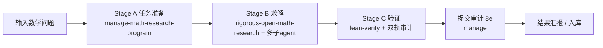
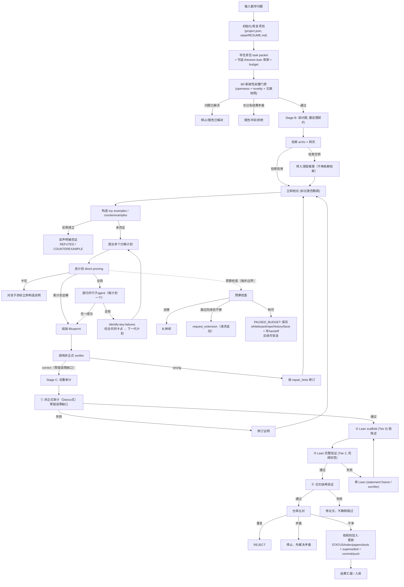

# Pipeline full flow: from a math problem to a verified result

This document describes one full run of the math-research workflow pipeline
(`$math-research-workflow` driving `manage-math-research-program` →
`rigorous-open-math-research` → `lean-verify` → submission audit), including
all major branches and terminal states.

## Overview

## Full flow with branches

## Branch summary

| 位置 | 分支 | 结果 |
| --- | --- | --- |
| B0 新颖性 | 已解决 / 矛盾 / 通过 | 停止 / 拒绝 / 继续 |
| 检索 | 有用 / 空转 | 继续 / 转深度推理 |
| 反例 | 成立 / 未成立 | 否证 / 继续 |
| 分解 | 某计划解 / 全败+递归 | 组装 / 失败综合下一轮 |
| 预算 | 够 / 追加 / 耗尽 | 继续 / 请求追加 / PAUSED_BUDGET |
| 非正式验证 | correct / wrong | Stage C / 修订 |
| Lean 验证 | 通过 / 失败 | 形式化通过 / 修 Lean 或回 NL |
| 论文级验证 | 通过 / 失败 | 交付 / 修论文 |
| 8e 比对 | 重复 / 矛盾 / 干净 | REJECT / 停止 / 入库 |

## Terminal states

- `FORMALLY_VERIFIED_PROOF` — 完整 + 机器验证
- `INDEPENDENTLY_AUDITED_PROOF` — 独立审计通过
- `CANDIDATE_COMPLETE_PROOF` — 候选完整证明
- `RIGOROUS_PARTIAL_RESULT` — 严格部分结果
- `COUNTEREXAMPLE_CANDIDATE` / `REFUTED` — 反例/否证
- `PAUSED_BUDGET` — 预算暂停，可恢复
- `NO_MATERIAL_PROGRESS` — 无实质进展
- `BLOCKED` / `INTERRUPTED`（带 handoff）— 阻塞/中断，可续接

## Research map

Throughout the run, every route/method, intermediate result, unexpected
finding, failure reason, tool, open direction, and human/other-agent
contribution is continuously collected into the project's `research_map.md`
(see `manage-math-research-program` workflow 8f).
