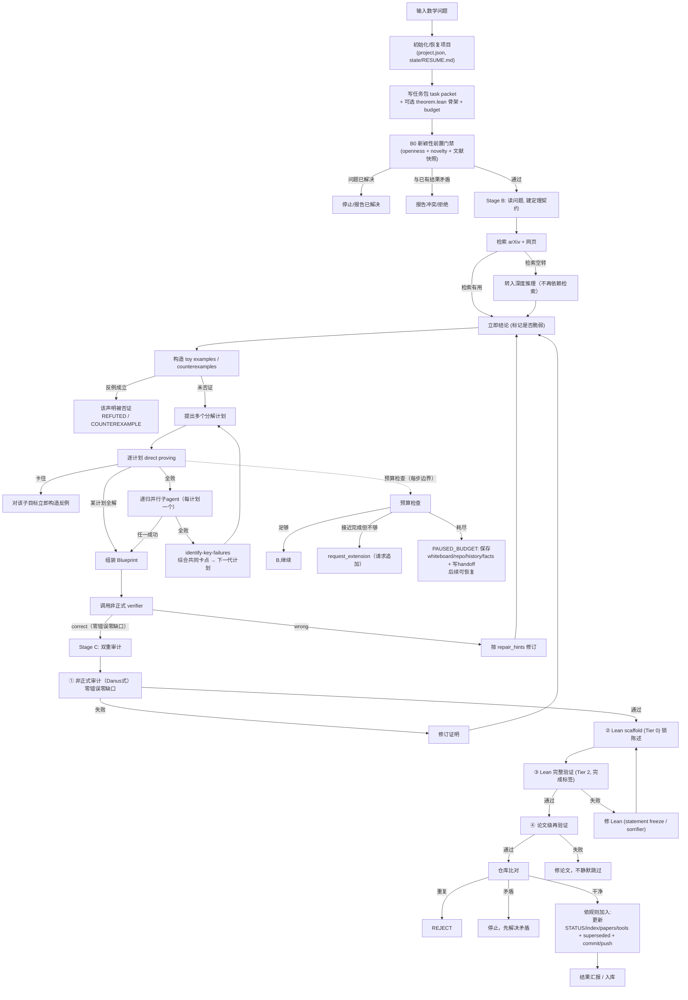

# Pipeline full flow: from a math problem to a verified result

This document describes one full run of the math-research workflow pipeline
(`$math-research-workflow` driving `manage-math-research-program` →
`rigorous-open-math-research` → `lean-verify` → submission audit), including
all major branches and terminal states.

## Overview


## Full flow with branches



## Branch summary

| 位置 | 分支 | 结果 |
| --- | --- | --- |
| B0 新颖性 | 已解决 / 矛盾 / 通过 | 停止 / 拒绝 / 继续 |
| 检索 | 有用 / 空转 | 继续 / 转深度推理 |
| 反例 | 成立 / 未成立 | 否证 / 继续 |
| 分解 | 某计划解 / 全败+递归 | 组装 / 失败综合下一轮 |
| 预算 | 够 / 追加 / 耗尽 | 继续 / 请求追加 / PAUSED_BUDGET |
| 非正式验证 | correct / wrong | Stage C / 修订 |
| Lean 验证 | 通过 / 失败 | 形式化通过 / 修 Lean 或回 NL |
| 论文级验证 | 通过 / 失败 | 交付 / 修论文 |
| 8e 比对 | 重复 / 矛盾 / 干净 | REJECT / 停止 / 入库 |

## Terminal states

- `FORMALLY_VERIFIED_PROOF` — 完整 + 机器验证
- `INDEPENDENTLY_AUDITED_PROOF` — 独立审计通过
- `CANDIDATE_COMPLETE_PROOF` — 候选完整证明
- `RIGOROUS_PARTIAL_RESULT` — 严格部分结果
- `COUNTEREXAMPLE_CANDIDATE` / `REFUTED` — 反例/否证
- `PAUSED_BUDGET` — 预算暂停，可恢复
- `NO_MATERIAL_PROGRESS` — 无实质进展
- `BLOCKED` / `INTERRUPTED`（带 handoff）— 阻塞/中断，可续接

## Research map

Throughout the run, every route/method, intermediate result, unexpected
finding, failure reason, tool, open direction, and human/other-agent
contribution is continuously collected into the project's `research_map.md`
(see `manage-math-research-program` workflow 8f).

## Real-time recording of routes and tools (method library)

Recording is **real-time, not deferred to the end**. At every material step:

- A route/attempt is opened → record it in `research_map.md` `## 2. Routes and
  methods tried` (route / who / status / evidence).
- A method or tool is invented/discovered → register it in `tools/` (or
  `knowledge/tools/`) **and** add a pointer in the research map `## 5. Tools and
  method library`, with provenance (producing run, inputs, environment, hash).
- An intermediate result / surprise appears → record in `research_map.md`
  `## 3. Intermediate results and unexpected findings`.
- A failure happens → record in `## 4. Failed attempts and failure reasons`
  and add the dead end to `## 7. Avoid list`.
- A human or another agent contributes a route → merge into `## 8. Human /
  other-agent contributions` as a lead to verify.

The workflow can use `scripts/update_research_map.py` (`--route`, `--finding`,
`--failure`, `--avoid`, `--human`) for these appends, or update the map
directly. This ensures partial progress and every created tool are captured
immediately, so later agents/humans can reuse them and do not rediscover or
re-optimize an already-explored route.

## Text/tree version of the full flow

```text
输入数学问题
   │
   ▼
Stage A · 任务准备 (manage-math-research-program)
   ├─ 初始化/恢复项目 (project.json, state/RESUME.md)
   ├─ 写任务包 task packet
   │    └─ 可选: theorem.lean 骨架 (带 sorry) + budget 块
   └─ B0 新颖性前置门禁 (openness + novelty + 文献快照)
        ├─ 问题已解决 ────────→ 停止 / 报告已解决
        ├─ 与已有结果矛盾 ────→ 报告冲突 / 拒绝
        └─ 通过 ─────────────→ 进入 Stage B
   │
   ▼
Stage B · 求解 (rigorous-open-math-research + 多子 agent)
   ├─ 读问题 → 建定理契约 / obligation graph
   ├─ [实时记录] 新路线/新工具出现 → 立即写入 research_map + tools/ 方法库
   ├─ 检索 (arXiv 定理搜索 + 网页)
   │    ├─ 检索有用 → 记录来源
   │    └─ 检索空转 → 转入深度推理 (不再依赖检索)
   ├─ 立即结论 (标记是否脆弱)
   │    └─ 脆弱 → 先构造反例
   ├─ 构造 toy examples / counterexamples
   │    ├─ [实时记录] 反例入库 (可复用反例库)
   │    └─ 反例成立 → 该声明被否证 → REFUTED / 分支死亡
   ├─ 提出多个分解计划 (materially different)
   │    ├─ [实时记录] 分解计划与失败综合写进 research_map
   │    ├─ 逐计划 direct proving
   │    │    ├─ 某计划全解 → 组装 Blueprint
   │    │    ├─ 卡住 → 对该子目标立即构造反例
   │    │    └─ 全败 → 递归并行子 agent (每计划一个)
   │    │         ├─ 任一成功 → 组装 Blueprint
   │    │         └─ 全败 → identify-key-failures
   │    │              └─ 综合共同卡点 → 下一代计划 → 回到「提出计划」
   │    └─ 预算检查 (每步边界)
   │         ├─ 足够 → 继续
   │         ├─ 接近完成但不够 → request_extension (请求追加)
   │         └─ 耗尽 → PAUSED_BUDGET: 保存 whiteboard/repo/history/facts
   │              + 写 handoff → 后续可恢复
   │
   ▼ (Blueprint 组装完成)
调用非正式 verifier
   ├─ correct (零错误零缺口) → 进入 Stage C
   └─ wrong → 按 repair_hints 修订 → 回到 Stage B
   │
   ▼
Stage C · 验证 (lean-verify + 双轨审计)
   ├─ ① 非正式审计 (Danus 式)
   │    ├─ 失败 → 修订证明 → 回 Stage B / 本地修订
   │    └─ 通过
   ├─ ② Lean scaffold (Tier 0) → 锁陈述、搭骨架
   │    └─ [实时记录] scaffold 登记到 STATUS / formalization_progress
   ├─ ③ Lean 完整验证 (Tier 2)
   │    ├─ 通过
   │    └─ 失败 → 修 Lean (statement freeze / sorrifier)
   │         └─ 若证明本身有缺陷 → 回自然语言证明
   ├─ ④ 论文级再验证 (如有 paper)
   │    ├─ 整篇 correct → 交付
   │    └─ 失败 → 修论文，不静默跳过
   │
   ▼
提交审计 8e
   ├─ 仓库比对
   │    ├─ 与现有结果重复 → REJECT
   │    ├─ 与现有结果矛盾 → 停止，先解决矛盾
   │    └─ 干净 → 继续
   ├─ (先查反例库: 已被反例/失败阻塞 → 拒绝或转修订)
   └─ 依规则加入
        ├─ 更新 STATUS / README / formalization_progress / research_map
        ├─ 更新 index / state / RESUME
        ├─ 正式验证 → papers/ LaTeX (8c)
        ├─ 新工具 → tools/ 带溯源 (已在过程中实时登记)
        ├─ 旧结果被覆盖 → 标 superseded
        └─ commit + push (origin → fork)
   │
   ▼
结果汇报 / 入库
```

All possible terminal states:

```text
FORMALLY_VERIFIED_PROOF / INDEPENDENTLY_AUDITED_PROOF
CANDIDATE_COMPLETE_PROOF        RIGOROUS_PARTIAL_RESULT
COUNTEREXAMPLE_CANDIDATE/REFUTED  PAUSED_BUDGET (可恢复)
NO_MATERIAL_PROGRESS             BLOCKED / INTERRUPTED (带 handoff)
```
